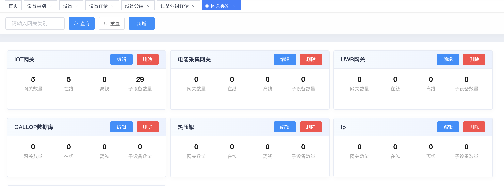
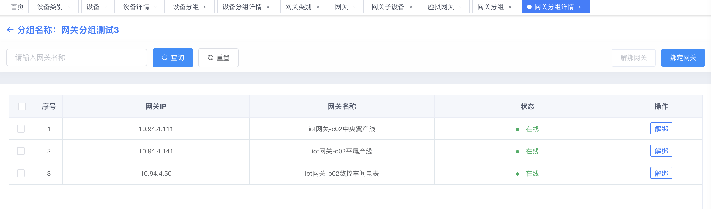
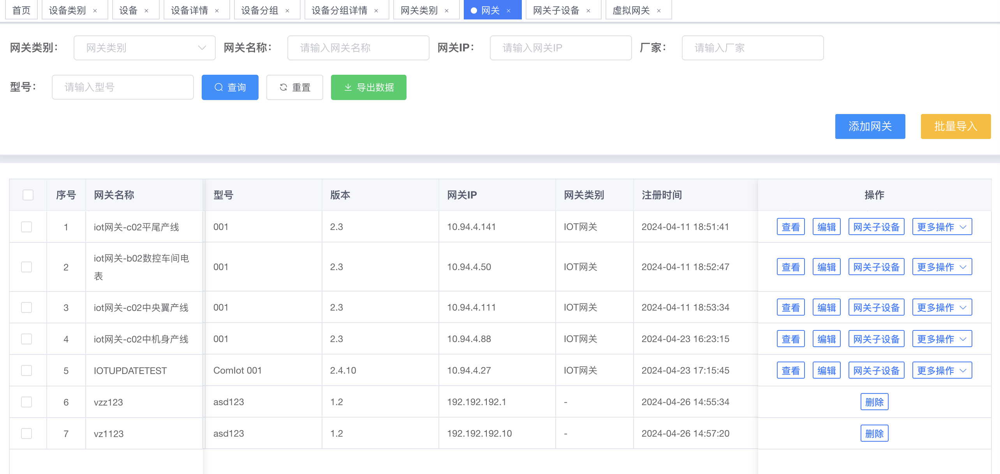
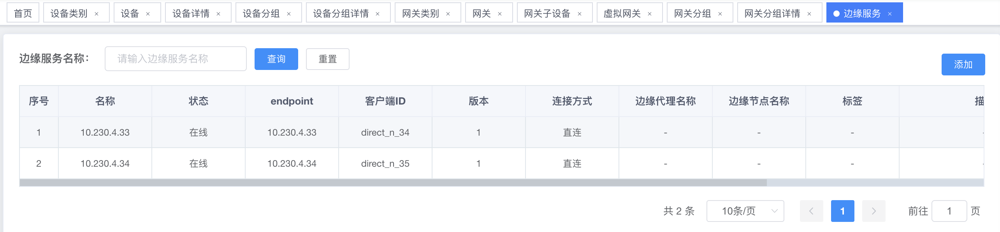
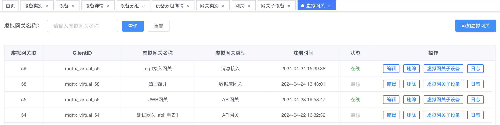

# 2.1网关管理

### 概述

网关管理专为物联网（IoT）环境设计的先进管理平台，它通过提供网关类别、网关分组、版本升级、Neuron网关、边缘服务以及虚拟网关等功能，为企业提供了一个全面、高效的网关监控和控制解决方案。该解决方案旨在简化网关操作流程，增强网关网络的可靠性和安全性，同时提升运营效率和降低维护成本。

### 主要功能

#### **网关类别**：

* 用户可以根据不同的业务需求和设备类型，创建自定义的网关类别，以便更好地组织和管理网关设备。
* 支持卡片展示网关类别的信息，包括网关数量、在线网关数量、离线网关数量、纳管的字设备的数量。

<figure><figcaption></figcaption></figure>

#### **网关分组**：

* 支持将网关设备进行逻辑分组，便于用户根据地理位置、功能或业务需求对网关进行分类管理。

<figure><figcaption></figcaption></figure>

#### **版本升级**：

* 支持协议包、软件包、固件包的版本管理、升级计划管理、失败重传、回滚功能和配置下发
* 支持全量、部分、点对点的版本管理和升级管理
* 支持冷热部署

#### **Neuron网关**：

* 支持输入网关ip直接同步网关信息到平台进行管理。
* 支持动态管理网关状态信息。
* 支持管理网关日志信息，以便于定位和跟踪网关问题。

<figure><figcaption></figcaption></figure>

#### **边缘服务**：

* 支持由云端统一注册、配置和管理，边缘网关对外暴露统一的地址

<figure><figcaption></figcaption></figure>

#### **虚拟网关**：

* 通过管理数据流生成的虚拟设备，提出虚拟网关概念，允许用户在没有物理网关的情况下，模拟网关功能进行数据处理和分析。

<figure><figcaption></figcaption></figure>

网关管理解决方案的核心功能围绕着提高网关的可管理性、可靠性和安全性展开。通过集成自定义网关类别、网关分组、版本升级、Neuron网关、边缘服务的直连网关以及虚拟网关，系统能够提供一个全面的管理解决方案，帮助用户实现对物联网网关的精细化管理，从而提升运营效率和降低成本。
