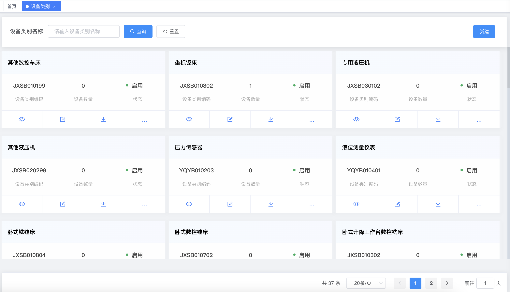
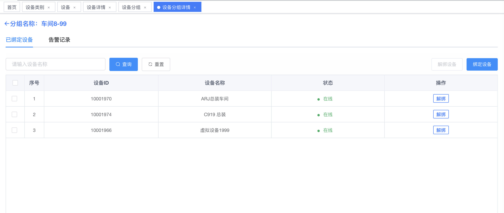
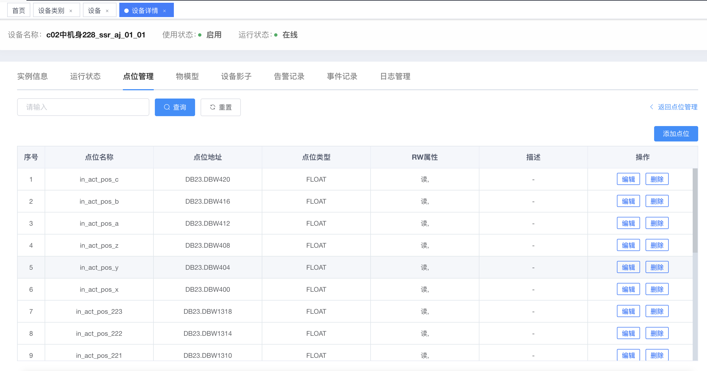
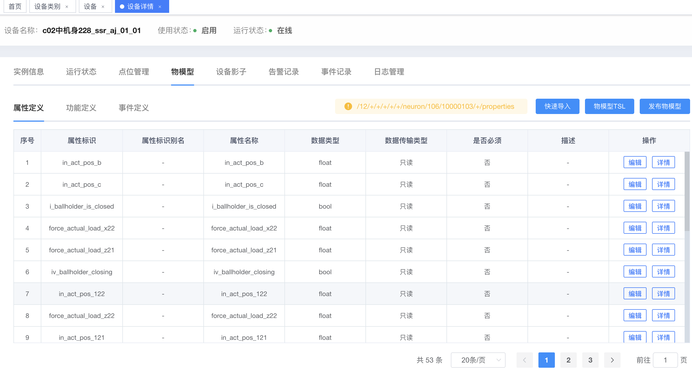

# 2.2设备管理

### 概述

设备管理旨在简化设备操作流程，增强设备网络的可靠性和安全性，同时提升运营效率和降低维护成本。

### 主要功能

#### **设备类别**：

* 用户可以根据不同的业务需求和设备类型，创建自定义的设备类别，以便更好地组织和管理设备。
* 支持创建设备类别的物模型

<figure><figcaption></figcaption></figure>

#### **设备分组**：

* 支持将设备进行逻辑分组，便于用户根据地理位置、功能或业务需求对设备进行分类管理。
* 支持创建设备分组的物模型

<figure><figcaption></figcaption></figure>

#### **物理设备**：

* 集成Neuron网关管理功能，支持对通过Neuron网关连接的物理设备进行远程配置和管理。
* 支持对纳管在平台上的设备进行启用、禁用、删除、解绑等操作
* 支持批量操作，支持选择导出纳管的设备信息
* 支持对设备上报的点位数据进行管理、存储以及统计分析操作
* 在设备详情页面，支持运行状态、点位管理、物模型、设备影子、告警记录、事件记录、日志管理功能

<figure><figcaption></figcaption></figure>

<figure><figcaption></figcaption></figure>

#### **虚拟设备**：

* 支持通过数据流接入注册的虚拟设备，包括数据库接入、API接入、MQTT消息接入等，实现数据的虚拟化管理和分析。
* 数据库接入：通过数据库读取设备信息后，根据业务需求进行设备注册、消息上报、信息存储等操作；
* API接入：通过调用API获取设备信息，进行设备注册、消息上报、信息存储等操作；
* MQTT 消息接入：设备使用生成的信息进行MQTT连接、设备注册、消息上报、信息存储等操作；平台可自定义设备注册和消息上报的数据格式。

#### **RTU类型设备**：

* 对于RTU（Modbus RTU协议）类型的设备，通过在neuron上注册设备后，根据业务需求，将该设备以点位组划分为设备进行纳管（即拼接设备名称与分组名称），再同步相关信息到平台进行管理
* 相较于其他物理设备,RTU在平台只支持点位层面的操作，即新增、删除、编辑点位信息

设备管理系统通过上述功能，能够提供一个全面的管理解决方案，帮助用户实现对物联网设备的精细化管理，从而提升运营效率和降低成本。
