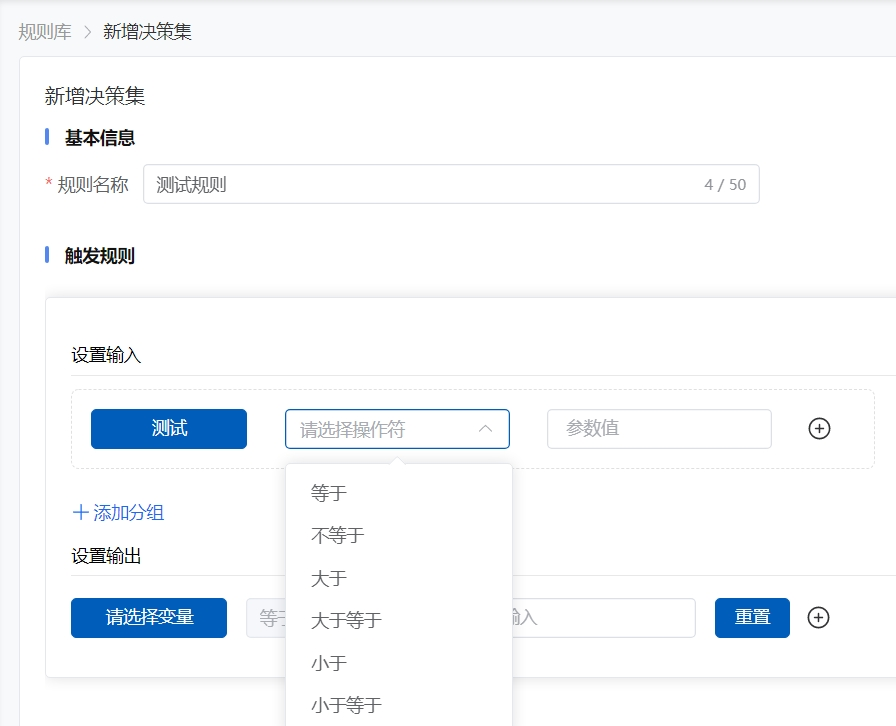

# 2.3.2规则集

### 概述

规则集是规则引擎中的核心组件，旨在通过直观、交互式的向导界面来简化复杂业务规则的创建和管理过程。这一功能通过一系列逐步引导的问题和选择，帮助用户在没有深入技术知识的情况下，也能轻松定义和调整业务逻辑。规则集适合那些需要频繁更新或调整规则的业务场景。

### 如何创建规则集

#### **步骤 1: 定义规则集**

* **命名规则集**：为规则集指定一个有意义的名称，以便于识别和管理。
* **描述规则集**：提供规则集的简要描述，说明其目的和预期用途。

#### **步骤 2: 添加规则**

* **创建规则**：在规则集中添加新的规则，每个规则包含条件和动作两部分。
* **设置条件**：定义规则触发的条件，支持简单的逻辑表达式，也支持复杂的业务逻辑。
* **定义动作**：指定当条件满足时系统应执行的操作，如发送通知、更新数据、下发指令等。

#### **步骤 3: 测试规则集**

* **模拟测试**：在实际部署前，使用模拟数据测试规则集的有效性和性能。
* **调试规则**：根据测试结果调整规则的条件和动作，确保规则集按预期工作。

#### **步骤 4: 部署规则集**

* **发布规则集**：将测试通过的规则集发布到生产环境，使其生效。
* **监控规则集**：在规则集运行过程中，监控其执行情况，确保业务流程的顺畅。

<figure><figcaption></figcaption></figure>

### 具体案例

#### **案例 1: \*\*车间空气检测异常，触发报警**

**规则集名称**：\*\*车间温度和湿度异常，触发报警

**描述**：该规则旨在监控车间内的温度和湿度，当检测到温度或湿度超出预设的安全范围时，系统将自动触发报警，通知相关人员采取措施。

**规则示例**：

* **条件**： 温度高于35°C或低于15°C。 湿度高于70%或低于30%。
* **动作**：下发指令给机器，进行告警。

#### **案例 2: \*\*型号机械臂运转异常，并发送告警通知**

**规则集名称**：\*\*型号机械臂运转异常，发送消息通知负责人员

**描述**：该规则用于监控车间内机械臂的运转状态，当检测到机械臂运转异常时，系统将自动发送消息通知负责人员，以便及时进行故障排查和维修。

**规则示例**：

* **条件**： 机械臂传感器检测到异常信号，如运转速度超出正常范围、温度异常升高、电流异常波动等。 机械臂控制系统报告错误代码或状态异常。
* **动作**：发送即时消息通知至负责机械臂维护的技术人员和车间管理人员的钉钉或蓝信账号。

通过这些案例，可以看出规则集在自动化业务流程中的重要作用。规则集的创建和管理是规则引擎实现高效、灵活业务决策的关键。
