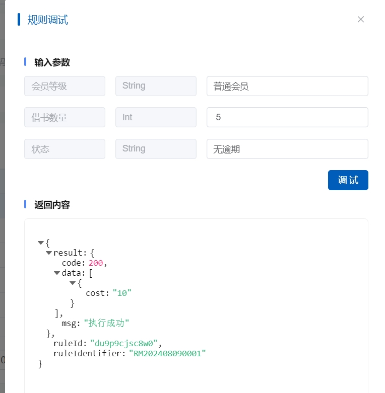

# 2.3.3决策表

### 概述

决策表是通过表格的形式直观地展示和定义复杂的业务规则。决策表将条件和动作以行列的形式组织，使得规则的创建、修改和管理更加清晰和高效。通过决策表，用户可以快速理解和应用业务逻辑，提高决策的准确性和一致性。

### 如何创建决策表

#### **步骤 1: 定义决策表**

* **命名决策表**：为决策表指定一个有意义的名称，以便于识别和管理。
* **描述决策表**：提供决策表的简要描述，说明其目的和预期用途。

#### **步骤 2: 添加条件和动作**

* **定义条件**：在决策表的输入条件单元格添加条件，每个条件对应一个业务规则的判断点。
* **定义动作**：在决策表的输出动作单元格添加动作，每个动作对应条件满足时系统应执行的操作。

#### **步骤 3: 配置规则**

* **设置条件值**：在决策表的输入条件单元格中设置具体的条件值。
* **设置动作值**：在决策表的输出动作单元格设置具体的动作值。

#### **步骤 4: 测试决策表**

* **模拟测试**：使用模拟数据测试决策表的有效性和性能，确保规则按预期工作。
* **调试规则**：根据测试结果调整条件和动作，确保决策表的准确性。

#### **步骤 5: 部署决策表**

* **发布决策表**：将测试通过的决策表发布到生产环境，使其生效。
* **监控决策表**：在决策表运行过程中，监控其执行情况，确保业务流程的顺畅。

### 相关案例

#### **案例 1: 图书馆借书流程**

**决策表**

| 条件1: 会员类型 | 条件2: 借书数量 | 条件3: 逾期情况 | 动作: 是否允许借书 | 动作: 借书费用 |
| --------- | --------- | --------- | ---------- | -------- |
| 普通会员      | 1-3本      | 无逾期       | 允许         | 免费       |
| 普通会员      | 1-3本      | 有逾期       | 不允许        | 0        |
| 普通会员      | 4-6本      | 无逾期       | 允许         | 10元      |
| 普通会员      | 4-6本      | 有逾期       | 不允许        | 0        |
| 高级会员      | 1-5本      | 无逾期       | 允许         | 免费       |
| 高级会员      | 1-5本      | 有逾期       | 允许         | 5元       |
| 高级会员      | 6-10本     | 无逾期       | 允许         | 20元      |
| 高级会员      | 6-10本     | 有逾期       | 不允许        | 0        |

**规则说明**

1. **普通会员**：
   * 如果借书数量在1-3本之间且无逾期，允许借书且免费。
   * 如果借书数量在1-3本之间且有逾期，不允许借书。
   * 如果借书数量在4-6本之间且无逾期，允许借书且费用为10元。
   * 如果借书数量在4-6本之间且有逾期，不允许借书。
2. **高级会员**：
   * 如果借书数量在1-5本之间且无逾期，允许借书且免费。
   * 如果借书数量在1-5本之间且有逾期，允许借书且费用为5元。
   * 如果借书数量在6-10本之间且无逾期，允许借书且费用为20元。
   * 如果借书数量在6-10本之间且有逾期，不允许借书。

**规则截图**

<figure><figcaption></figcaption></figure>

**调试截图**

<figure><figcaption></figcaption></figure>

这个规则展示了如何使用决策表来管理复杂的借书流程，考虑了会员类型、借书数量和逾期情况，并根据这些条件决定是否允许借书以及相应的费用。

通过以上案例，可以看出决策表在自动化业务流程中的重要作用。决策表的创建和管理是规则引擎实现高效、灵活业务决策的关键。
