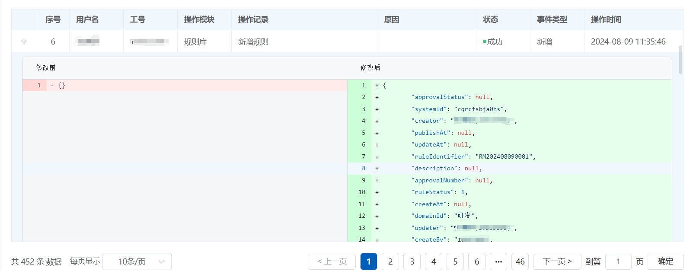
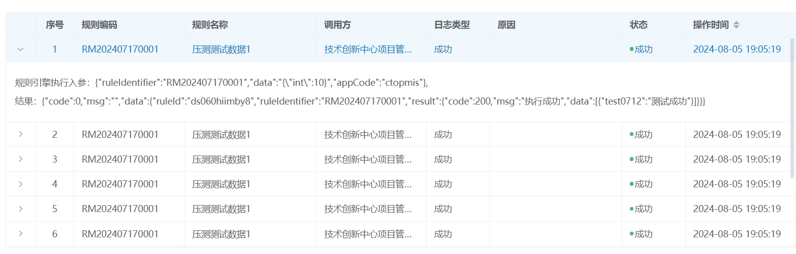

# 2.3.4日志管理

#### 概述

规则日志管理是规则引擎中的一个关键功能，它负责记录和追踪规则的执行历史和状态。通过规则日志，用户可以监控规则的运行情况，排查问题，优化性能，并确保业务流程的透明度和可追溯性。规则日志管理模块通常包括日志记录、查询等功能，帮助用户全面了解规则引擎的运行状态。

#### 核心功能

**1. 日志记录**

* **详细记录**：规则日志管理模块会详细记录每一次规则的执行情况，包括触发时间、执行结果、涉及的数据等。
* **多维度记录**：支持按规则名称、执行时间、用户、业务流程等多个维度记录日志，便于后续的查询和分析。

**2. 日志查询**

* **灵活查询**：提供强大的查询功能，用户可以根据不同的条件（如时间范围、规则名称、执行结果等）快速检索日志。
* **实时查询**：支持实时查询最新的日志记录，确保用户能够及时获取规则执行的最新信息。

<figure><figcaption></figcaption></figure>

<figure><figcaption></figcaption></figure>

通过规则日志管理功能，规则引擎不仅提高了系统的透明度和可维护性，还为用户提供了强大的工具来监控和优化业务流程。这一功能是确保规则引擎高效、稳定运行的关键组成部分。
