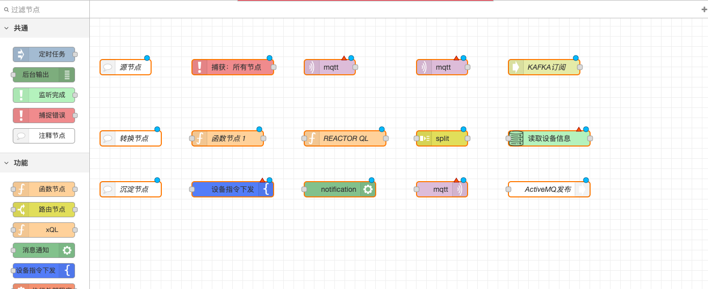

# 2.5.1基本原则

### 概述

本功能旨在提供一个高效、灵活的数据流管理平台，支持用户通过Node-RED创建、管理和部署数据处理流程。该功能特别适用于需要实时数据处理和多渠道输出的场景，如物联网数据分析、实时监控系统等。

### **主要特点**

#### **节点类型多样化：**

* **源（Source）节点**：负责数据的采集和输出，无输入端口，如Kafka和MQTT订阅节点。
* **转换节点**：负责数据的处理和转换，具有输入和输出端口。
* **沉淀（Sink）节点**：负责数据的存储和输出，无输出端口，如数据库保存节点和WebSocket推送节点。

<figure><figcaption></figcaption></figure>

#### **数据传递标准化：**

* 数据在节点间以JSON格式传递，主要数据保存在`payload`字段中。
* 某些源节点（如Kafka和MQTT订阅节点）会将消息的主题保存在`topic`字段中。
* 定时任务节点和函数节点可以通过设置`msg.topic`字段或使用JavaScript代码来指定传递给下游的`topic`字段。
* 某些沉淀节点（如WebSocket推送节点）可以修改输出消息的`topic`字段。

#### **灵活的部署管理：**

由于数据流是长时间运行的，因此在修改流之后重新部署时，需要注意以下原则：

* **流程停止与部署**：如果提示流程已经在执行，请先在Node-RED中停止流程，再进行部署。
* **部署时机**：建议只有在修改流程后才在Node-RED中点击部署按钮部署流程，其他情况请使用Node-RED中的启动流程来启用流程。

### **场景举例**

* **物联网数据处理**：通过源节点收集传感器数据，经过转换节点处理后，由沉淀节点存储或推送到客户端。
* **实时监控系统**：实时收集监控数据，通过转换节点进行分析，最终通过沉淀节点存储或实时推送给监控界面。
* **多渠道数据输出**：支持将处理结果同时输出到数据库和WebSocket客户端，或通过HTTP接口和WebSocket同时推送数据。
