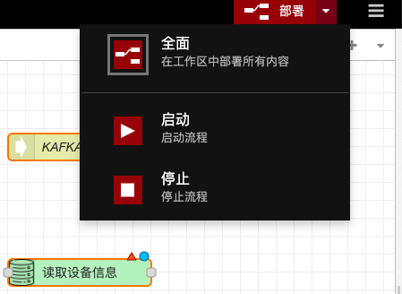
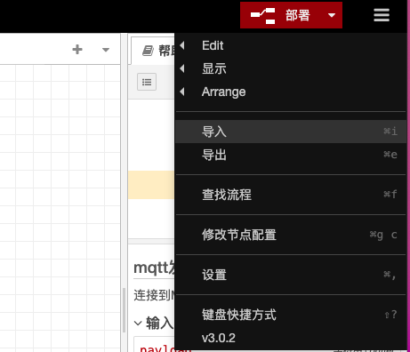
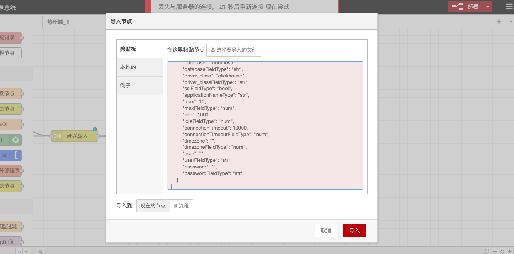

# 2.5.2数据流配置

### 概述

数据流配置功能是Node-RED平台的核心组成部分，提供了一套直观且强大的工具，用于创建、管理和部署数据处理流程。通过图形化的界面和丰富的节点库，用户可以轻松构建复杂的数据流，实现数据的采集、处理、转换和输出。

### **主要功能**

#### **添加数据流**

* 用户可以通过点击“添加数据流”按钮，快速进入数据流配置面板，开始新的数据流设计。

**流程名称配置**

* 用户可以双击流程tab标题，输入流程名称和描述，便于管理和识别不同的数据流。

#### **节点添加与操作**

* 用户可以从左侧工具栏选择节点，通过拖放操作将其添加到面板中。
* 支持节点的单个选择或部分选择，以及复制、剪切、粘贴和删除操作。

#### **节点连线**

* 用户可以通过点击节点侧边连接点并拖动，实现节点之间的连线，构建数据流的逻辑关系。

#### **节点移动与帮助信息查看**

* 用户可以移动节点到面板的其他位置，并通过悬停节点查看帮助信息，获取节点的详细说明。

#### **流程部署**

* 用户在节点配置完毕后，可以点击部署按钮，实现数据流的实时运行和更新。
* 支持流程的暂停和重新部署，确保数据流的稳定运行。

<figure><figcaption></figcaption></figure>

#### **已有配置的导入、导出**

* 用户可以通过导入功能，将已有的数据流文件或JSON内容导入到画板中。
* 支持将当前流程导出为JSON文件或复制到粘贴板，便于备份和共享。

<figure><figcaption></figcaption></figure>

<figure><figcaption></figcaption></figure>
