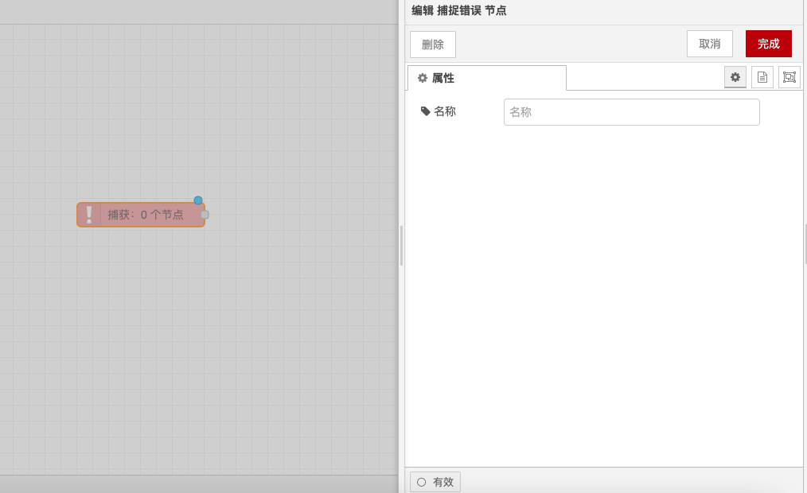

# 捕捉错误节点

### 功能描述

错误捕获节点用于捕获由同一标签页上的节点引发的错误，并通过专用流程进行处理。以下是详细的功能描述和配置选项：

### 输出

* **error.message**：字符串，错误消息。
* **error.source.id**：字符串，引发错误的节点的ID。
* **error.source.type**：字符串，引发错误的节点的类型。
* **error.source.name**：字符串，引发错误的节点的名称（如果已设置）。

### 详细

* **错误处理**：如果节点在处理消息时抛出错误，流程通常会停止。错误捕获节点可用于捕获这些错误并通过专用流程进行处理。
* **捕获范围**：默认情况下，该节点将捕获同一标签页上任何节点抛出的错误。或者，它可以针对特定节点，或配置为仅捕获另一个“目标”捕获节点尚未捕获的错误。
* **错误传播**：当错误发生时，所有匹配的捕获节点都会收到错误消息。
* **子流错误处理**：如果在子流中发送了错误，则该错误将由子流中的任意捕获节点处理。如果子流中不存在捕获节点，则错误将被传播到子流实例所在的标签页。
* **错误属性**：如果消息已经具有 `error` 属性，则将该 `error` 复制为 `_error`。

通过以上配置，你可以在Node-RED中捕获并处理由其他节点引发的错误，确保流程的稳定性和可靠性。

<figure><figcaption></figcaption></figure>
