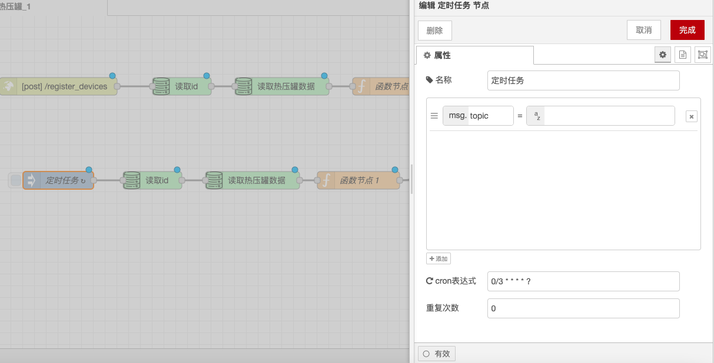

# 定时任务节点

### **功能描述**

定时任务节点用于手动或定期地将消息注入流中。消息的有效荷载可以为多种类型，包括字符串、JavaScript 对象或当前时间。

### **输出**

* **payload**：指定的消息的有效荷载，可以是字符串、数字、布尔值、JavaScript 对象或流/全局上下文值。
* **topic**：可以在节点中配置的可选属性，用于指定消息的主题。

### **详细**

* **默认有效荷载**：默认情况下，节点会注入当前时间的时间戳（以毫秒为单位，自1970年1月1日起）。
* **手动触发**：默认情况下，节点可以通过在编辑器中单击节点按钮来手动触发。
* **定期或按计划注入**：节点也可以被设置为定期或按计划注入消息。
* **一次性注入**：另一个可选的设置是在每次启动流时注入一次消息。
* **最大间隔**：可以指定的最大间隔约为596小时/24天。对于间隔超过一天的那些间隔，建议使用 scheduler 节点来应对断电或重启。

### **注意**

* **时间间隔和特定时间**：选项“时间间隔”和“特定时间”使用了标准 cron 系统。这意味着“20分钟”并不表示在此之后20分钟，而是每小时的20分钟，40分钟。如果您希望设定为从现在开始的每20分钟，那么请使用“间隔”选项。
* **换行符**：如果您想在字符串中包含换行符，必须使用“功能”节点创建有效荷载。

通过这些配置选项，定时任务节点能够灵活地控制消息的注入时间和频率，确保流能够按照预定的计划被触发和执行。

<figure><figcaption></figcaption></figure>

####
