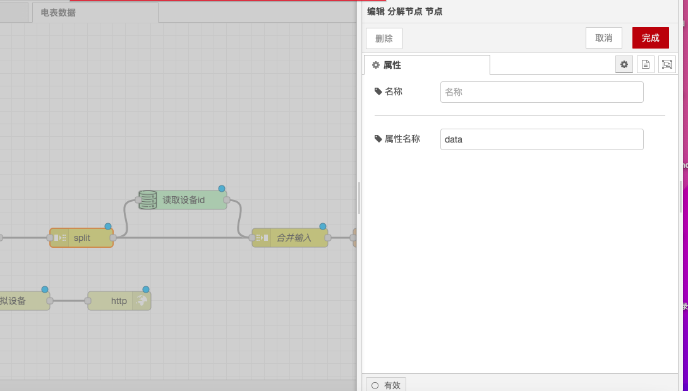

# 分解节点

### 功能描述

* **输入类型**：节点的行为由 `msg.payload` 的类型决定：
  * **字符串/buffer**：使用指定的字符（默认值：\n），缓冲区序列或固定长度将消息拆分。
  * **数组**：消息被拆分为单个数组元素或固定长度的数组。
  * **对象**：将为对象的每个键/值对发送一条消息。

### 输出

* **parts**：此属性包含有关如何将消息与原始消息分开的信息。如果传递给join节点，则可以将序列重组为单个消息。该属性具有以下属性：
  * **id**：一组消息的标识符。
  * **index**：组中的位置。
  * **count**：如果已知组中的邮件总数。请参阅下面的“流媒体模式”。
  * **type**：消息的类型（字符串/数组/对象/buffer）。
  * **ch**：对于字符串或buffer，用于将消息拆分为字符串或字节数组的数据。
  * **key**：对于对象，创建此消息的属性的键。可以将节点配置为也将此值复制到另一个消息属性，例如 `msg.topic`。
  * **len**：使用固定长度值拆分消息时，每段子消息的长度。

### 详细

* **序列重组**：在使用join节点将序列重新组合为单个消息之前，推荐使用此节点来轻松地创建跨消息序列，执行通用操作的流。
* **msg.parts属性**：它使用 `msg.parts` 属性跟踪序列的各个部分。
* **流媒体模式**：该节点还可以用于重排消息流。例如，发送换行符终止命令的串行设备可能会传递一条消息，并在其末尾带有部分命令。在“流模式”下，此节点将拆分一条消息并发送每个完整的段。如果末尾有部分片段，则该节点将保留该片段，并将其添加到收到的下一条消息之前。
* **流模式下的count属性**：在此模式下运行时，该节点将不会设置 `msg.parts.count` 属性，因为流中期望的消息数还是未知的。这意味着它不能在自动模式下与join节点一起使用。

通过以上配置，你可以在Node-RED中使用分解节点将消息拆分为一系列消息，并处理其输出。

<figure><figcaption></figcaption></figure>
