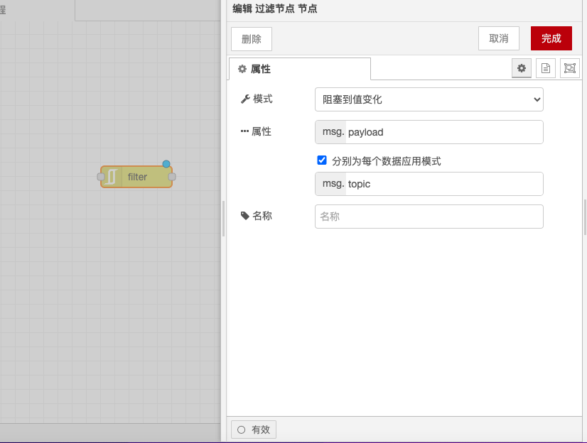

# 过滤节点

### 功能描述

* **RBE模式**：仅在消息的有效负载（或选定属性）值与前一个值不同时才传递消息。如果需要，可以忽略初始值，以免在启动时发送任何消息。
* **Deadband模式**：仅在输入值的变化大于或等于±带隙（band gap）时才传递消息。
* **Narrowband模式**：仅在输入值的变化小于或等于±带隙（band gap）时才传递消息。这对于忽略故障传感器产生的异常值非常有用。

### 输入

* **payload**：数值、字符串或简单对象。RBE模式接受这些类型，其他模式必须提供可解析的数值。
* **topic**：字符串，如果指定，函数将基于每个主题进行工作。此属性可以通过配置设置。
* **reset**：如果设置，将清除指定 `msg.topic` 的存储值，如果 `msg.topic` 未指定，则清除所有主题的存储值。

### 输出

* **payload**：与输入相同。如果触发，输出将与输入相同。

### 详细

* **RBE模式**：在RBE模式下，节点将阻止消息，直到 `msg.payload`（或选定属性）值与前一个值不同。如果需要，可以忽略初始值，以免在启动时发送任何消息。
* **Deadband模式**：在Deadband模式下，节点将阻止输入值，除非其变化大于或等于±带隙（band gap）。
* **Narrowband模式**：在Narrowband模式下，节点将阻止输入值，如果其变化大于或等于±带隙（band gap）。这对于忽略故障传感器产生的异常值非常有用。
* **带隙支持百分比**：在Deadband和Narrowband模式下，输入值必须包含可解析的数值，并且两者都支持百分比——仅在输入值的变化超过原始值的x%时才发送。
* **比较模式**：在Deadband和Narrowband模式下，可以与前一个有效输出值进行比较，从而忽略任何超出范围的值，或者与前一个输入值进行比较，这会重置设定点，从而允许逐渐漂移（Deadband）或步长变化（Narrowband）。
* **基于主题的工作**：此节点基于每个 `msg.topic` 工作，尽管这可以更改为另一个属性（如果需要）。这意味着单个过滤节点可以同时处理多个不同的主题。

通过以上配置，你可以在Node-RED中使用过滤节点根据特定条件过滤消息，并处理其输出。

<figure><figcaption></figcaption></figure>
