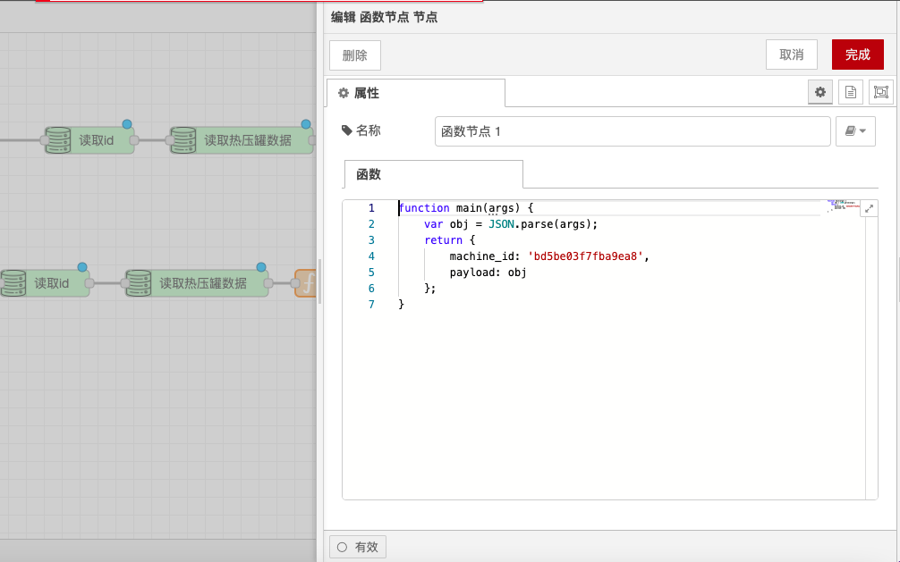

# 函数节点

### **功能描述**

函数节点用于定义对接收到的消息进行处理的 JavaScript 代码（函数的主体）。输入消息在名为 `msg` 的 JavaScript 对象中传递，通常消息正文保留在 `msg.payload` 属性中。该函数一般会返回一个消息对象（或多个消息对象），但也可以为了停止流而什么都不返回。

### **详细配置**

#### **传送消息**：

* 要将消息传递到流中的下一个节点，请返回消息或调用 `node.send(messages)`。
* 返回单个消息对象时，传递给连接到第一个输出的节点。
* 返回消息对象数组时，传递给连接到相应输出的节点。
* 如果数组元素是数组，则将多个消息发送到相应的输出。
* 如果返回值为 `null`，则不会发送任何消息。

#### **日志输出和错误处理**：

*   使用以下功能输出日志信息和输出错误：

    ```javascript
    node.log("Log message");
    node.warn("Warning");
    node.error("Error");
    ```
*   使用 `catch` 节点进行错误处理。要由 `catch` 节点处理，请将 `msg` 作为 `node.error` 的第二个参数传递：

    ```javascript
    node.error("Error", msg);
    ```

#### **访问节点信息**：

*   可以使用以下属性来在代码中引用节点 ID 和名称：

    ```javascript
    node.id;   // 节点的ID
    node.name; // 节点的名称
    ```

#### **使用环境变量**：

* 环境变量可以通过 `env.get("MY_ENV_VAR")` 来进行访问。

### **示例**

*   **简单消息处理**：

    ```javascript
    // 将消息正文转换为大写
    msg.payload = msg.payload.toUpperCase();
    return msg;
    ```
*   **多个输出**：

    ```javascript
    // 将消息发送到两个不同的输出
    var msg1 = { payload: "Output 1" };
    var msg2 = { payload: "Output 2" };
    return [msg1, msg2];
    ```
*   **错误处理**：

    ```javascript
    // 检查消息正文是否为空，如果为空则抛出错误
    if (!msg.payload) {
      node.error("Payload is empty", msg);
    }
    return msg;
    ```
*   **使用环境变量**：

    ```javascript
    // 获取环境变量并将其添加到消息中
    var envVar = env.get("MY_ENV_VAR");
    msg.payload = "Environment variable: " + envVar;
    return msg;
    ```

### **使用场景**

* **数据转换**：在数据转换应用中，函数节点用于对数据进行格式转换、计算等操作。
* **条件判断**：在需要根据条件进行不同处理的场景中，函数节点用于编写条件判断逻辑。
* **错误处理**：在需要进行错误处理和日志记录的场景中，函数节点用于编写错误处理逻辑。
* **环境变量使用**：在需要使用环境变量的场景中，函数节点用于访问和使用环境变量。

### **注意事项**

* **代码质量**：确保函数代码简洁、高效，避免不必要的复杂性。
* **错误处理**：在关键逻辑中加入适当的错误处理，确保系统稳定运行。
* **环境变量**：在使用环境变量时，确保环境变量已正确配置。

通过这些配置选项和功能，函数节点能够灵活地处理和操作消息，确保流能够按照预定的逻辑执行。

<figure><figcaption></figcaption></figure>
