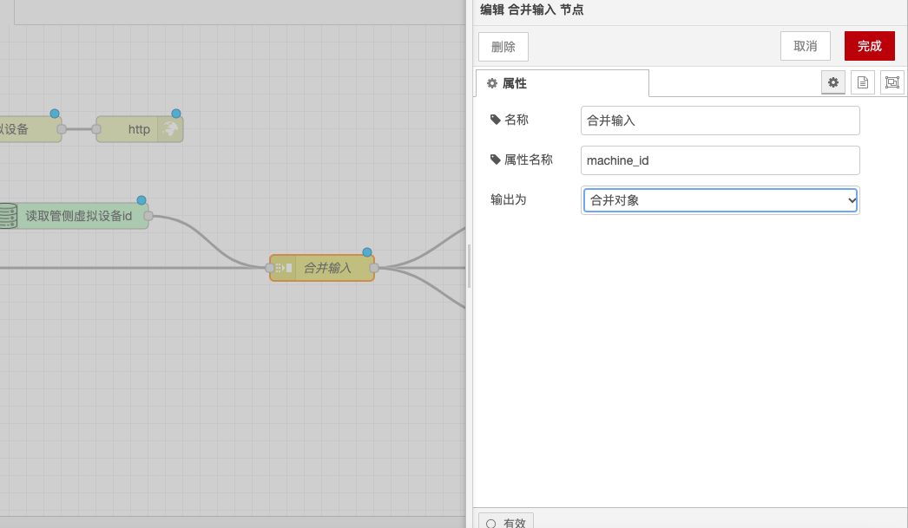

# 合并输入节点

### 功能描述

合并输入节点用于将消息序列合并为一条消息。它提供了三种模式：自动模式、手动模式和列聚合模式。以下是详细的功能描述和配置选项：

### 模式

#### **自动模式**

* **功能**：与split节点配对时，它将自动将已被拆分的消息进行合并。
* **输入**：使用自动模式时，所有的消息都应包含 `parts` 属性。split节点会生成此属性，但也可以手动进行设置。该属性具有以下属性：
  * `id`：消息组的标识符。
  * `index`：组中的位置。
  * `count`：如果已知组中的邮件总数。
  * `type`：消息的类型（字符串/数组/对象/buffer）。
  * `ch`：对于字符串或buffer，用于将消息拆分为字符串或字节数组的数据。
  * `key`：对于对象，创建此消息的属性的键。
  * `len`：使用固定长度值拆分消息时，每段子消息的长度。
  * `complete`：如果设置，则节点将以其当前状态发送其输出消息。

#### **手动模式**

* **功能**：手动地以各种方式合并消息序列。
* **方法**：
  * **字符串或缓冲区**：通过将每条消息的选定属性与指定的连接字符或缓冲区连接起来。
  * **数组**：通过将每个选定的属性或整个消息添加到输出数组。
  * **键/值对象**：通过使用每个消息的属性来确定存储所需值的键。
  * **merged object**：通过将每个消息的属性合并到一个对象下。
* **输出消息的其他属性**：取自发送结果前的最后一条消息。
* **计数**：确定应接收多少条消息来进行合并。
* **超时**：设置发送新消息之前的等待时间。
* **msg.complete**：如果收到设置了 `msg.complete` 属性的消息时发送输出消息并重置消息列数。
* **msg.reset**：如果收到设置了 `msg.reset` 属性的消息，则部分收到的消息将被删除而不发送，同时重置消息列数。

#### **列聚合模式**

* **功能**：对消息列中的所有消息应用表达式以将其简化为单个消息。
* **初始值**：累积值的初始值（$A）。
* **聚合表达式**：序列中的每个消息调用的JSONata表达式。结果将作为累加值传递到表达式的下一个调用。可以使用以下特殊变量：
  * `$A`：累计值。
  * `$I`：消息在序列中的索引。
  * `$N`：序列中的消息数。
* **最终调整式子**：可选的JSONata表达式，在将聚合表达式应用于序列中的所有消息之后应用。可以使用以下特殊变量：
  * `$A`：累计值。
  * `$N`：消息在序列中的索引。
* **顺序**：默认情况下，按顺序从序列的第一条消息到最后一条消息应用聚合表达式。也可以选择以相反的顺序应用聚合表达式。

### 示例

给定一系列数字值，以下设置将计算平均值：

* **聚合表达式**：`$A + payload`
* **初始值**：0
* **最终调整式**：`$A / $N`

### 储存讯息

该节点将在内部缓存消息，以便跨序列工作。运行时设置 `nodeMessageBufferMaxLength` 可用于设定缓存的消息数。

通过以上配置，你可以在Node-RED中使用合并输入节点将消息序列合并为一条消息，方便后续处理和分析。

<figure><figcaption></figcaption></figure>
