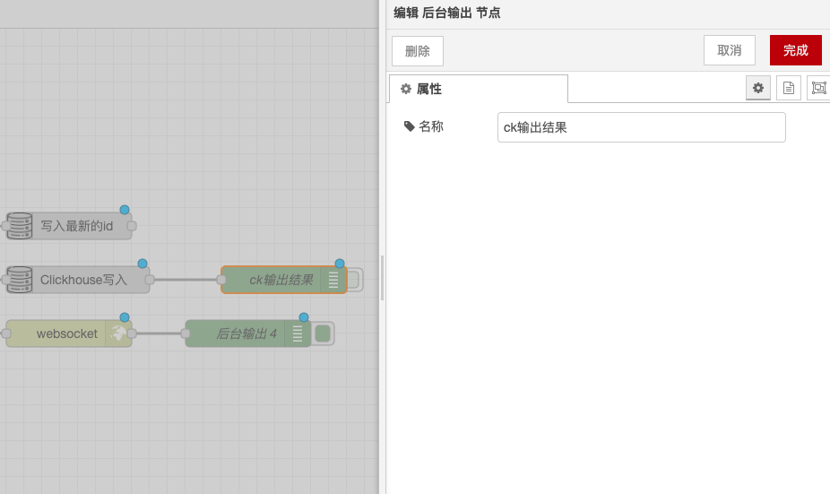

# 后台输出节点

### 功能描述

后台输出节点用于在“调试”侧边栏选项卡和运行时日志中显示选定的消息属性。以下是详细的功能描述和配置选项：

### 输出

* **默认输出**：默认情况下，会显示 `msg.payload` 的值。
* **自定义输出**：可以设置显示任意属性、完整消息或JSONata表达式的结果。

### 详细

* **调试侧边栏**：调试侧边栏会提供已发消息的结构化视图，方便查询消息的结构。
* **对象和数组**：JavaScript对象和数组可以根据需要来折叠或扩展。
* **缓冲区对象**：缓冲区对象可以显示为原始数据，也可以显示为字符串。
* **消息信息**：对任意条消息，调试侧边栏还会显示接收消息的时间、发送消息的节点以及消息类型等信息。单击源节点ID将在工作区中显示该节点。
* **启用/禁用输出**：节点上的按钮可用于启用或禁用其输出。建议禁用或删除所有未使用的调试节点。
* **运行时日志**：还可以通过配置节点，将所有消息发送到运行时的日志，或将简短的数据（32个字符内）在调试节点下的状态文本上显示。

通过以上配置，你可以在Node-RED中使用后台输出节点显示消息属性，方便调试和监控消息流。

<figure><figcaption></figcaption></figure>
