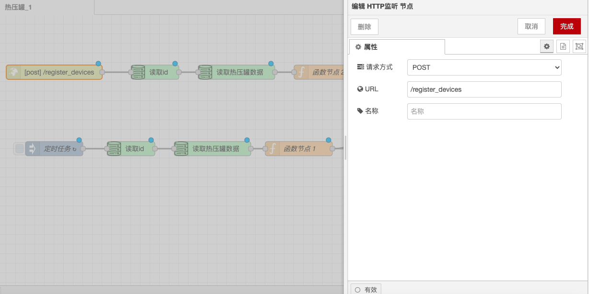

# HTTP 监听节点

### **功能描述**

HTTP 监听节点用于监听 HTTP 请求，当有 HTTP 请求到达时，触发相应的流程。它可以配置请求方式、URL、头信息等参数，并处理请求数据。

### **配置选项**

* **请求方式**：可以选择 GET 或 POST 请求方式。
  * **GET 请求**：用于从服务器获取数据，通常不包含请求体。
  * **POST 请求**：用于向服务器提交数据，通常包含请求体。
* **URL**：设置请求的目标地址，可以是 HTTP 或 HTTPS 地址。
* **头信息**：设置请求头，如 Content-Type、Authorization 等。
  * **Content-Type**：指定请求体的数据格式，例如 `application/json` 或 `application/x-www-form-urlencoded`。
  * **Authorization**：用于身份验证，可以设置 Basic Auth 或 Bearer Token。

### **详细配置**

* **路径**：设置监听的路径，例如 `/api`。
* **方法**：设置监听的 HTTP 方法，例如 GET、POST 等。
* **响应头**：设置响应头信息，如 Content-Type、Cache-Control 等。
  * **Content-Type**：指定响应体的数据格式，例如 `application/json` 或 `text/html`。
  * **Cache-Control**：设置缓存策略，例如 `no-cache`、`max-age=3600` 等。
* **响应体**：设置响应的内容，可以是字符串、JSON 对象等。
  * **字符串**：返回简单的文本内容，例如 "Hello, World!"。
  * **JSON 对象**：返回结构化的数据，例如 `{"message": "Success"}`。

通过这些配置选项和功能，HTTP 监听节点能够灵活地处理和响应 HTTP 请求，确保客户端能够正确发送和接收数据。

<figure><figcaption></figcaption></figure>
