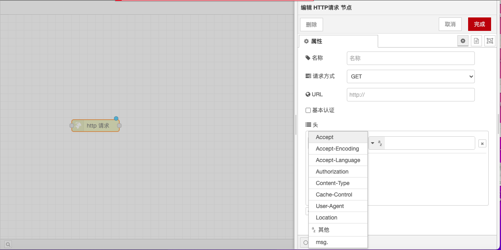

# HTTP请求节点

### **功能描述**

HTTP 请求节点用于发送 HTTP 请求并返回响应。它可以配置 URL、请求方法、请求头、cookies、请求体等参数，并处理响应的正文、状态码、响应头等信息。

### **输入**

* **url**：如果未在节点中配置，则此可选属性设置请求的 URL。
* **method**：如果未在节点中配置，则此可选属性设置请求的 HTTP 方法。必须是 GET, PUT, POST, PATCH 或 DELETE 之一。
* **headers**：设置请求的 HTTP 头。
* **cookies**：如果设置，则可用于发送带有请求的 cookie。
* **payload**：发送为请求的正文。
* **rejectUnauthorized**：如果设置为 false，则允许对使用自签名证书的 HTTPS 站点进行请求。
* **followRedirects**：如果设置为 false，则阻止遵循重定向（HTTP 301）。默认情况下为 true。
* **requestTimeout**：如果设置为正数毫秒，将覆盖全局设置的 httpRequestTimeout 参数。

### **输出**

* **payload**：响应的正文。可以将节点配置为以字符串形式返回主体，尝试将其解析为 JSON 字符串或将其保留为二进制 buffer。
* **statusCode**：响应的状态码，如果请求无法完成，则返回错误码。
* **headers**：包含响应头的对象。
* **responseUrl**：如果在处理请求时发生任何重定向，则此属性为最终重定向的 URL。否则则为原始请求的 URL。
* **responseCookies**：如果响应包含 cookie，则此属性是每个 cookie 的‘名称/值’键值对的对象。
* **redirectList**：如果请求被重定向了一次或多次，则累积的信息将被添加到此属性。“location”是下一个重定向目标。cookie 是从重定向源返回的 cookie。

### **详细**

* **URL 配置**：在节点内配置后，URL 属性可以包含 mustache 样式标签。这些标签允许使用传入消息的值来构造 URL。例如，如果 URL 设置为 `example.com/{{topic}}`，它将自动插入 `msg.topic` 的值。使用 `{{{...}}}` 可以防止 mustache 转义 `/ &` 等字符。
* **GET 请求的查询字符串参数**：节点可以选择自动将 `msg.payload` 编码为 GET 请求的查询字符串参数，在这种情况下，`msg.payload` 必须是一个对象。
* **代理设置**：如果使用了代理，则应设置 `http_proxy=...` 环境变量并重新启动 Node-RED，或使用“代理配置”。如果设置了代理配置，则配置优先于环境变量。
* **多个 HTTP 请求节点**：为了在一个流程中多次使用该节点，必须要注意 `msg.headers` 属性的处理。通常在第一个节点在响应头中设置此属性，而不期望在下一个节点的请求头中使用此属性。如果节点之间的 `msg.headers` 属性保持不变，则第二个节点将忽略它。要设置自定义标题，首先应删除 `msg.headers` 或将其重置为空对象：`{}`。
* **Cookie 处理**：传递给节点的 cookies 属性必须是‘名称/值’键值对的对象。该值可以是设置 cookie 值的字符串，也可以是具有单个 value 属性的对象。请求返回的所有 cookie 都将在 `responseCookies` 属性下传递回去。
* **内容类型处理**：如果 `msg.payload` 是一个对象，则节点将自动将请求的内容类型设置为 `application/json` 并对其进行编码。要将请求编码为表单数据，应将 `msg.headers["content-type"]` 设置为 `application/x-www-form-urlencoded`。
*   **文件上传**：要执行文件上传，应将 `msg.headers["content-type"]` 设置为 `multipart/form-data` 和 `msg.payload` 传递给节点的必须是具有以下结构的对象：

    ```json
    {
        "KEY": {
            "value": FILE_CONTENTS,
            "options": {
                "filename": "FILENAME"
            }
        }
    }
    ```

    `KEY`, `FILE_CONTENTS` 和 `FILENAME` 的值应设置为适当的值。

通过这些配置选项和功能，HTTP 请求节点能够灵活地处理和发送 HTTP 请求，并处理响应数据，确保流能够按照预定的计划被触发和执行。

<figure><figcaption></figcaption></figure>
