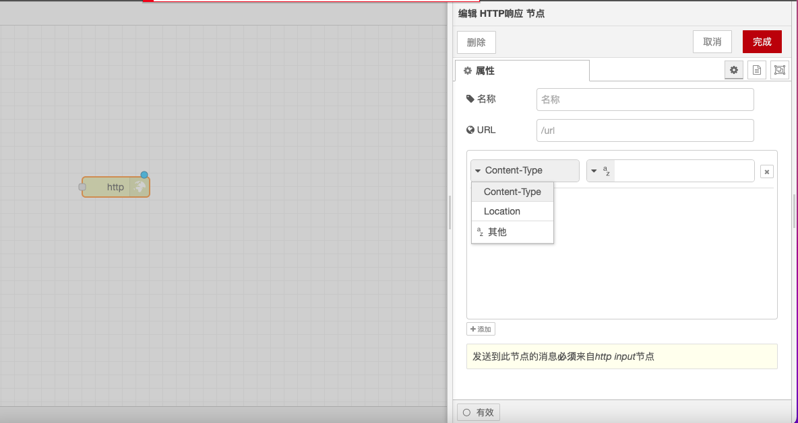

# HTTP 响应节点

### **功能描述**

HTTP 响应节点用于配置 HTTP 响应，与 HTTP 监听节点配套使用，确保能够正确返回处理后的数据给客户端。它允许用户设置响应的状态码、响应头和响应体，以便客户端能够正确解析和处理响应。

### **配置选项**

* **状态码**：设置响应的状态码，如 200、404 等。
  * **200**：表示请求成功。
  * **404**：表示请求的资源未找到。
  * **500**：表示服务器内部错误。
  * **其他状态码**：根据需要设置其他状态码，如 201（创建成功）、401（未授权）等。
* **响应头**：设置响应头信息，如 Content-Type、Cache-Control 等。
  * **Content-Type**：指定响应体的数据格式，例如 `application/json` 或 `text/html`。
  * **Cache-Control**：设置缓存策略，例如 `no-cache`、`max-age=3600` 等。
  * **其他头信息**：根据需要设置其他响应头，如 Authorization、Set-Cookie 等。
* **响应体**：设置响应的内容，可以是字符串、JSON 对象、HTML 文档等。
  * **字符串**：返回简单的文本内容，例如 "Hello, World!"。
  * **JSON 对象**：返回结构化的数据，例如 `{"message": "Success"}`。
  * **HTML 文档**：返回 HTML 页面，例如 `<html><body><h1>Welcome</h1></body></html>`。

### **详细配置**

* **状态码**：
  * 可以根据请求的处理结果动态设置状态码，例如在处理成功时返回 200，在处理失败时返回 400 或 500。
* **响应头**：
  *   可以设置多个响应头，每个头信息以键值对的形式存在。例如：

      ```json
      {
        "Content-Type": "application/json",
        "Cache-Control": "no-cache"
      }
      ```
* **响应体**：
  * 响应体的内容可以根据请求的处理结果动态生成。例如，在处理成功时返回一个包含处理结果的 JSON 对象，在处理失败时返回一个包含错误信息的 JSON 对象。

通过这些配置选项和功能，HTTP 响应节点能够灵活地处理和返回 HTTP 响应，确保客户端能够正确解析和处理响应数据。

<figure><figcaption></figcaption></figure>
