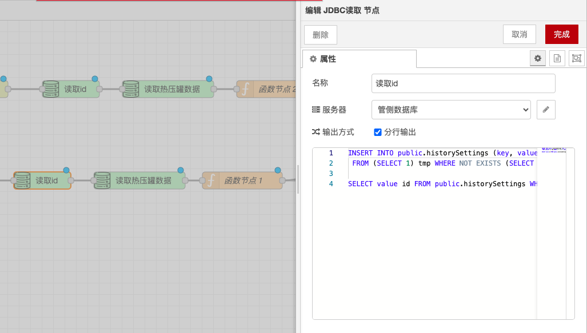
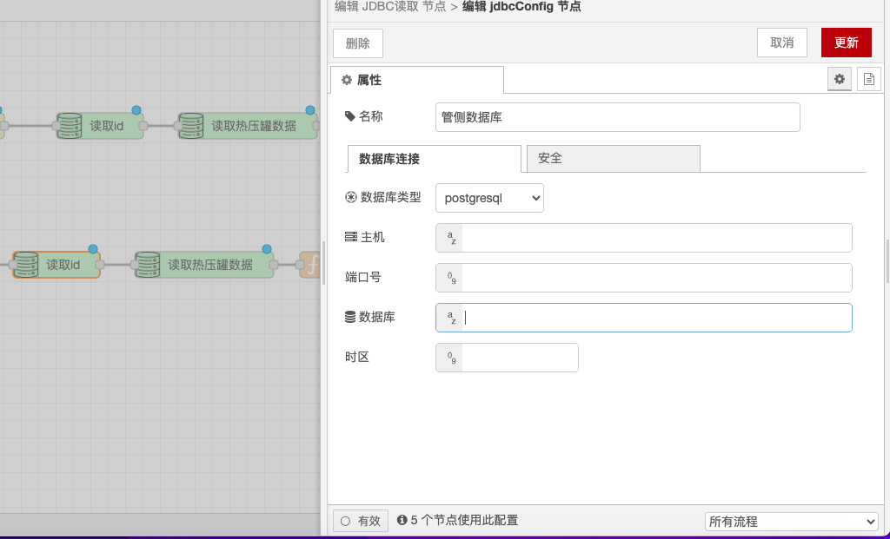

# JDBC 读取与写入节点

### **功能描述**

* **JDBC 读取节点**：用于从数据库读取数据并转换为 JSON 格式。它允许用户通过配置 SQL 查询语句来获取数据库中的数据，并将结果转换为 JSON 格式以便进一步处理。
* **JDBC 写入节点**：用于将 JSON 数据写入数据库。它允许用户通过配置 SQL 插入或更新语句来将 JSON 数据写入数据库。

### **配置选项**

* **数据库连接信息**：包括主机名、端口、数据库名、用户名和密码。
  * **主机名**：数据库服务器的主机名或 IP 地址。
  * **端口**：数据库服务器的端口号，例如 MySQL 默认端口为 3306。
  * **数据库名**：要连接的数据库名称。
  * **用户名**：用于连接数据库的用户名。
  * **密码**：用于连接数据库的密码。
* **SQL 语句**：
  * **读取节点的查询语句**：用于从数据库中读取数据的 SQL 查询语句，例如 `SELECT * FROM table_name WHERE condition`。
  * **写入节点的插入或更新语句**：用于将数据写入数据库的 SQL 插入或更新语句，例如 `INSERT INTO table_name (column1, column2) VALUES (value1, value2)` 或 `UPDATE table_name SET column1 = value1 WHERE condition`。

### **详细配置**

* **数据库连接信息**：
  * 确保数据库服务器可访问，并且提供的连接信息正确无误。
  * 可以使用环境变量或配置文件来存储敏感信息（如密码），以提高安全性。
* **SQL 语句**：
  * **读取节点的查询语句**：
    * 可以使用参数化查询来提高安全性，避免 SQL 注入攻击。
    * 查询结果将自动转换为 JSON 格式，方便后续节点处理。
  * **写入节点的插入或更新语句**：
    * 可以使用参数化语句来确保数据的安全性和正确性。
    * 写入节点可以处理复杂的 JSON 结构，将其转换为数据库表中的行和列。

### **注意事项**

* **安全性**：确保数据库连接信息的安全，避免泄露敏感信息。
* **性能优化**：在处理大量数据时，考虑数据库连接池和批量操作以提高性能。
* **错误处理**：在 SQL 语句执行失败时，确保有适当的错误处理机制。

通过这些配置选项和功能，JDBC 读取与写入节点能够灵活地处理和操作数据库数据，确保数据能够正确地读取和写入。

<figure><figcaption></figcaption></figure>

<figure><figcaption></figcaption></figure>
