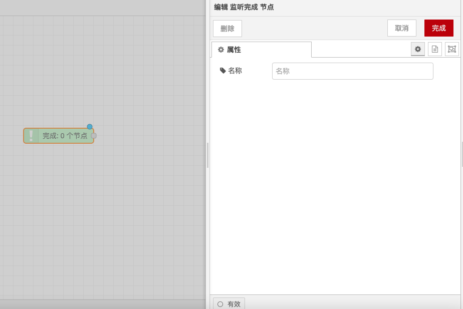

# 监听完成节点

#### 监听完成节点

**功能描述**

监听完成节点用于在另一个节点完成对消息的处理时触发流。如果一个节点通知运行时它已完成消息的处理，该节点可用于触发第二个流。这个节点可以与没有输出端口的节点一起使用，例如在使用电子邮件发送节点来发送邮件后触发一个流。

**详细配置**

* **触发条件**：监听完成节点只能被设置为处理流中某个所选节点的事件。与 Catch 节点不同，您不能指定“所有节点”模式并以流中的所有节点为目标。
* **支持节点**：并非所有节点都会触发此事件。这取决于它们是否支持于 Node-RED 1.0 中引入的此功能。

**使用场景**

* **邮件发送后处理**：在使用电子邮件发送节点发送邮件后，触发一个流来执行后续操作，如记录日志、通知其他系统等。
* **文件处理后操作**：在文件处理节点完成文件处理后，触发一个流来执行文件归档、通知用户等操作。
* **数据库操作后处理**：在数据库操作节点完成数据插入或更新后，触发一个流来执行数据同步、日志记录等操作。

**注意事项**

* **节点支持**：确保所选节点支持触发完成事件，否则监听完成节点将无法正常工作。
* **单一节点监听**：监听完成节点只能监听流中某个特定节点的完成事件，不能监听所有节点的事件。
* **流设计**：在设计流时，考虑监听完成节点的位置和触发条件，确保流能够按照预期顺序执行。

通过这些配置选项和功能，监听完成节点能够灵活地处理和触发流，确保流能够按照预定的逻辑执行。

<figure><figcaption></figcaption></figure>
