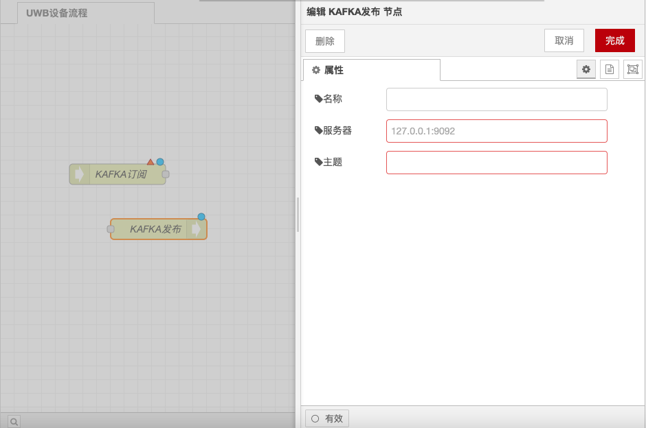
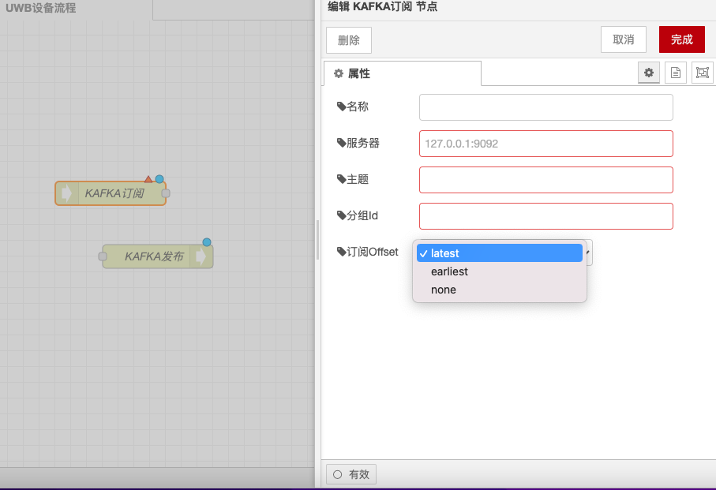

# Kafka 发布与订阅节点

### 功能描述

Kafka 发布节点用于向 Kafka 主题发布消息，而 Kafka 订阅节点用于从 Kafka 主题订阅消息。以下是详细的功能描述和配置选项：

### Kafka 发布节点

#### **功能描述**

* **获取连接**：Kafka 发布节点首先获取与 Kafka 服务器的连接，以便后续节点可以使用该连接发布消息。
* **消息发布**：成功获取连接后，节点将消息发送到指定的 Kafka 主题。
* **失败处理**：如果获取连接或发布消息失败，节点将消息发送到失败连接器进行处理。

#### **配置选项**

* **Kafka 服务器地址**：设置 Kafka 服务器的地址和端口，例如 `localhost:9092`。
* **主题**：指定发布消息的 Kafka 主题，例如 `my-topic`。
* **认证信息**（可选）：如果 Kafka 服务器需要认证，可以设置用户名和密码。
* **消息键**（可选）：指定消息的键，用于 Kafka 分区。
* **消息值**：指定要发布的消息内容。

<figure><figcaption></figcaption></figure>

### Kafka 订阅节点

#### **功能描述**

* **获取连接**：Kafka 订阅节点首先获取与 Kafka 服务器的连接，以便后续节点可以使用该连接订阅消息。
* **消息订阅**：成功获取连接后，节点将从指定的 Kafka 主题订阅消息。
* **失败处理**：如果获取连接或订阅消息失败，节点将消息发送到失败连接器进行处理。

#### **配置选项**

* **Kafka 服务器地址**：设置 Kafka 服务器的地址和端口，例如 `localhost:9092`。
* **主题**：指定订阅消息的 Kafka 主题，例如 `my-topic`。
* **认证信息**（可选）：如果 Kafka 服务器需要认证，可以设置用户名和密码。
* **消费者组**：指定消费者组，用于管理消息的订阅。
* **偏移量**：指定从哪个偏移量开始订阅消息，例如 `latest` 或 `earliest`。

<figure><figcaption></figcaption></figure>

通过以上配置，你可以在Node-RED中使用Kafka 发布和订阅节点进行消息的发布和订阅，并处理可能的失败情况。
