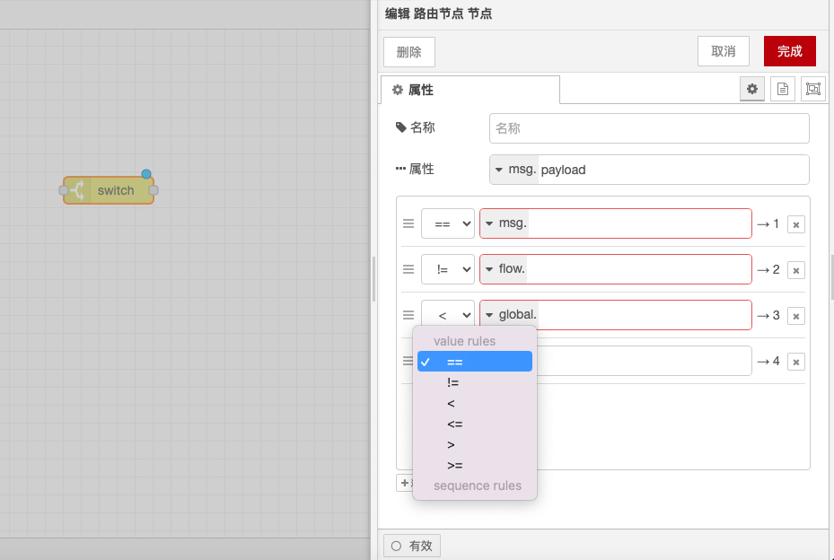

# 路由节点

### **功能描述**

路由节点用于根据消息的属性值来分配消息的传送路线。它根据接收到的消息评估指定的规则，然后将消息发送到与匹配的规则相对应的输出端口。

### **配置选项**

* **停止后续匹配**：可以将节点设置为一旦发现一个匹配的规则，则停止后续的匹配。
* **评估规则**：可以使用消息属性、流上下文/全局上下文属性、环境变量和 JSONata 表达式的评估结果来定义规则。

### **规则类型**

路由节点支持以下四种规则类型：

1. **值评估规则**：根据配置的属性评估规则。
2. **顺序规则**：用于消息序列的规则，例如由“拆分”节点生成的规则。
3. **JSONata 表达式规则**：评估整个消息，如果结果为真，则匹配。
4. **默认规则**：当其他上述规则都不匹配时适用。

### **规则匹配细节**

* **is true/false 规则**：对类型进行严格的匹配，匹配之前的类型转化不会发生。
* **is null 规则**：对类型进行严格的匹配，匹配之前的类型转化不会发生。
* **is empty 规则**：与零字节的字符串、数组、缓冲区或没有属性的对象相匹配，与 null 或者 undefined 等不匹配。

### **处理消息序列**

* **默认行为**：节点不会修改 `msg.parts` 属性。
* **重建消息序列选项**：可以启用此选项来为每条匹配的规则生成新的消息序列。在这种模式下，节点将在发送新序列之前对整个传入序列进行缓存。
* **消息缓存限制**：运行时的设定 `nodeMessageBufferMaxLength` 可以用来限制可缓存的消息数目。

通过这些配置选项和规则类型，路由节点能够灵活地处理和分发消息，确保消息能够按照预定的规则被正确地传送到相应的输出端口。

<figure><figcaption></figcaption></figure>
