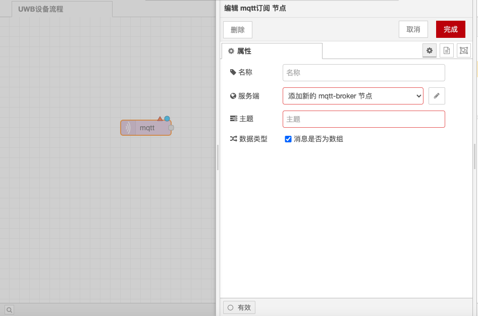
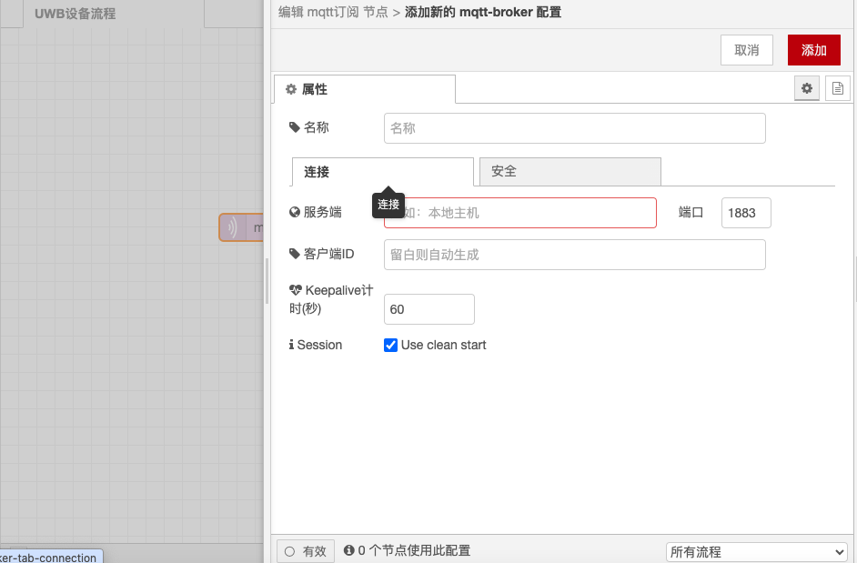
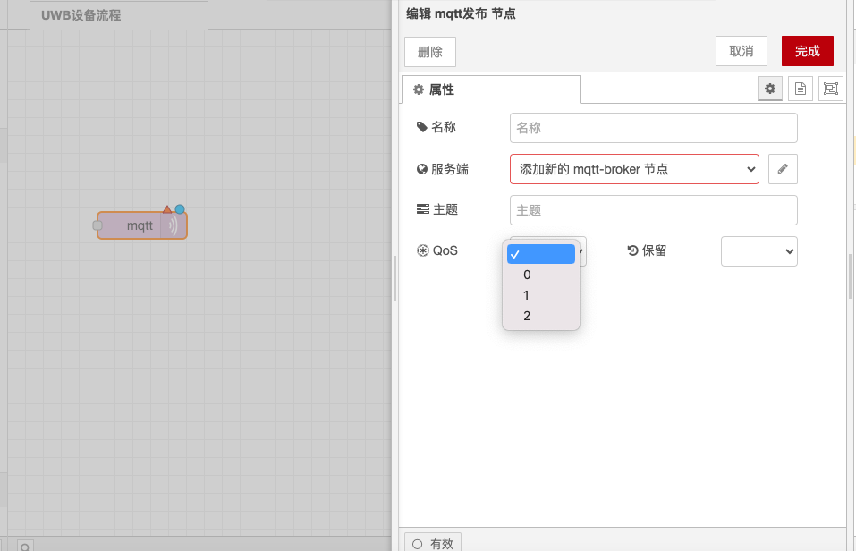
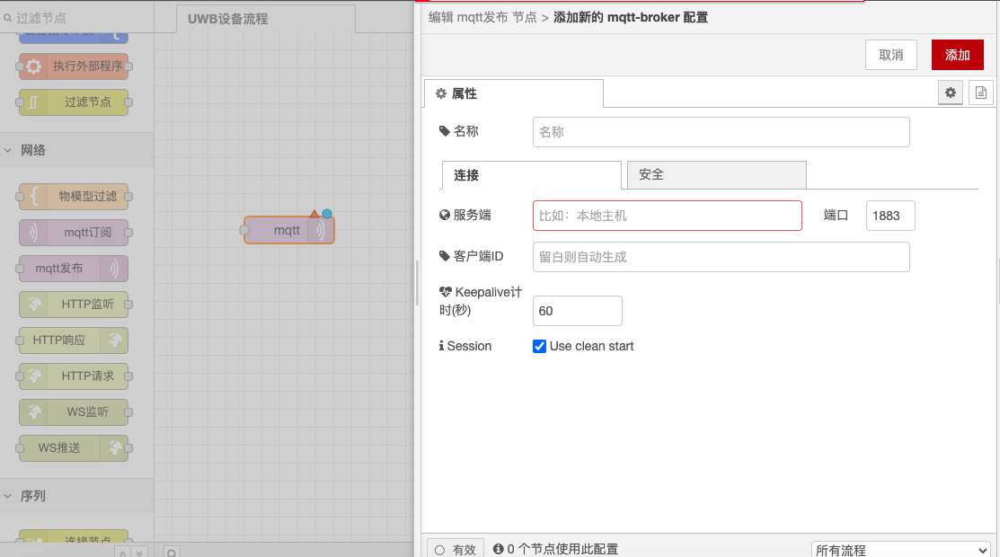

# MQTT 发布与订阅节点

### 功能描述

MQTT 订阅节点用于连接到 MQTT 代理并订阅来自指定主题的消息，而 MQTT 发布节点用于连接到 MQTT 代理并发布消息。以下是详细的功能描述和配置选项：

### MQTT 订阅节点

#### **功能描述**

* **连接到 MQTT 代理**：MQTT 订阅节点连接到 MQTT 代理并订阅来自指定主题的消息。
* **输出**：
  * **payload**：字符串或 buffer，如果不是二进制 buffer 的话就是字符串。
  * **topic**：字符串，MQTT 主题，使用 `/` 作为层次结构分隔符。
  * **qos**：数值，QoS 服务质量：0（最多一次），1（最少一次），2（只一次）。
  * **retain**：布尔值，值为 true 时表示消息已保留且可能是旧的。

#### **配置选项**

* **MQTT 代理地址**：设置 MQTT 代理的地址和端口，例如 `mqtt://localhost:1883`。
* **订阅主题**：指定要订阅的 MQTT 主题，可以包括 MQTT 通配符（+：一个级别，#：多个级别）。
* **QoS**：设置订阅的 QoS 级别。

<figure><figcaption></figcaption></figure>

<figure><figcaption></figcaption></figure>

### MQTT 发布节点

#### **功能描述**

* **连接到 MQTT 代理**：MQTT 发布节点连接到 MQTT 代理并发布消息。
* **输入**：
  * **payload**：字符串或 buffer，要发布的有效负载。如果未设置此属性，则不会发送任何消息。要发送空白消息，请将此属性设置为空字符串。
  * **topic**：字符串，要发布的 MQTT 主题。
  * **qos**：数值，QoS 服务质量：0（最多一次），1（最少一次），2（只一次）。默认值为 0。
  * **retain**：布尔值，设置为 true 来将消息保留在代理上。默认值为 false。

#### **配置选项**

* **MQTT 代理地址**：设置 MQTT 代理的地址和端口，例如 `mqtt://localhost:1883`。
* **发布主题**：指定要发布的 MQTT 主题。
* **QoS**：设置发布的 QoS 级别。
* **retain**：设置是否保留消息。

<figure><figcaption></figcaption></figure>

<figure><figcaption></figcaption></figure>

通过以上配置，你可以在Node-RED中使用MQTT 订阅和发布节点进行消息的订阅和发布，并处理可能的失败情况。
