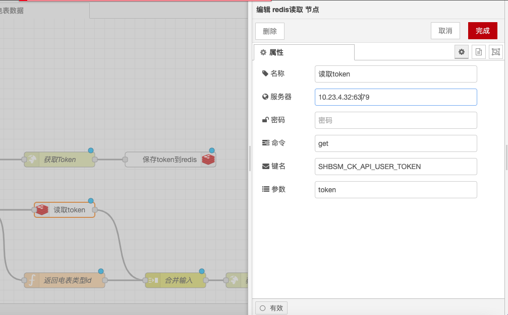
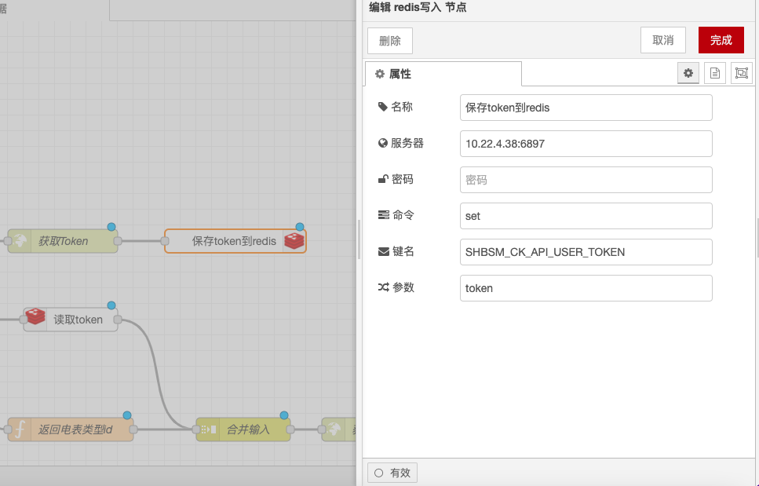

# Redis 读取与写入节点

### 功能描述

Redis 读取节点（Redis in）和 Redis 写入节点（Redis out）用于在 Node-RED 中与 Redis 数据库进行交互。以下是详细的功能描述和配置选项：

### Redis 读取节点（Redis in）

#### **功能描述**

* **订阅功能**：Redis 读取节点充当订阅者，可以使用 BLPOP、SUBSCRIBE 或 PSUBSCRIBE 方法从 Redis 读取数据。
* **主题模式**：`msg.topic` 是所有方法的主题模式，多个主题用空格分隔。
* **模式支持**：只有 PSUBSCRIBE 方法支持带有通配符的模式。

#### **配置选项**

* **Redis 服务器地址**：设置 Redis 服务器的地址和端口，例如 `localhost:6379`。
* **认证信息**（可选）：如果 Redis 服务器需要认证，可以设置密码。
* **订阅方法**：选择 BLPOP、SUBSCRIBE 或 PSUBSCRIBE。
* **主题模式**：设置要订阅的主题或模式。

<figure><figcaption></figcaption></figure>

### Redis 写入节点（Redis out）

#### **功能描述**

* **发布功能**：Redis 写入节点充当发布者，可以使用 RPUSH、LPUSH 或 PUBLISH 方法向 Redis 写入数据。
* **主题键名**：`msg.topic` 是要发布数据的键名。
* **输出结果**：只有 PUBLISH 方法返回订阅者的数量。

#### **配置选项**

* **Redis 服务器地址**：设置 Redis 服务器的地址和端口，例如 `localhost:6379`。
* **认证信息**（可选）：如果 Redis 服务器需要认证，可以设置密码。
* **发布方法**：选择 RPUSH、LPUSH 或 PUBLISH。
* **主题键名**：设置要发布数据的键名。

<figure><figcaption></figcaption></figure>

通过以上配置，你可以在Node-RED中使用Redis 读取和写入节点进行数据的读取和写入，并处理可能的失败情况。
