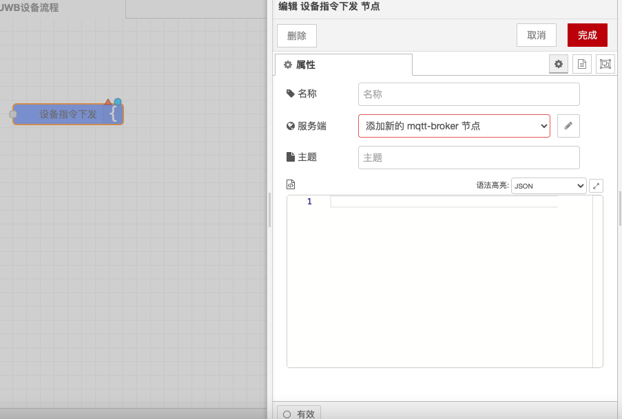
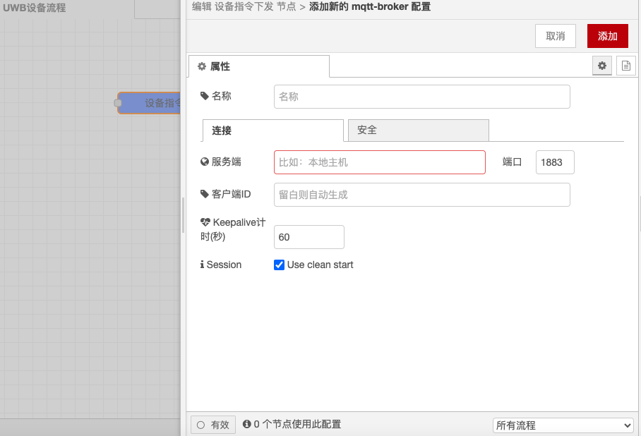

# 设备指令节点

### 功能描述

设备指令节点通过EMQX服务器向指定设备发送指令。它允许用户指定目标设备的ID并定义发送的指令内容，以便远程控制和管理设备。

### 配置选项

* **设备ID**：指定目标设备的ID，确保指令能够准确发送到指定的设备。
* **指令内容**：定义发送的指令内容，可以是简单的文本指令，也可以是包含变量的动态指令。

### 详细配置

#### **设备ID**

* **输入**：在节点配置中，输入目标设备的唯一标识符（ID）。确保设备ID正确无误，以便指令能够准确发送到指定的设备。
* **来源**：设备ID通常由设备制造商提供，或者在设备注册时自动生成。

#### **指令内容**

* **定义**：在节点配置中，定义发送的指令内容。可以使用静态文本，也可以使用动态变量，如 `msg.payload`、`msg.topic` 等。
* **格式**：指令内容应符合设备支持的指令格式，确保设备能够正确解析和执行指令。

### 示例

#### **简单指令**

```json
{
  "deviceId": "device_1234",
  "command": "turn_on"
}
```

#### **动态指令**

```json
{
  "deviceId": "device_1234",
  "command": "set_temperature {{msg.payload}}"
}
```

### 使用场景

* **远程控制**：在智能家居、工业自动化等应用中，设备指令节点用于远程控制设备，如开关灯、调节温度等。
* **设备管理**：在设备管理系统中，设备指令节点用于向设备发送配置更新、固件升级等指令。
* **数据采集**：在数据采集应用中，设备指令节点用于向设备发送数据采集指令，如读取传感器数据、执行诊断操作等。

### 注意事项

* **设备ID**：确保设备ID正确无误，以便指令能够准确发送到指定的设备。
* **指令格式**：确保指令内容符合设备支持的指令格式，避免设备无法正确解析和执行指令。
* **安全性**：在发送指令时，注意保护设备ID和指令内容，避免泄露敏感信息。

### MQTT代理连接设置

在Node-RED中，MQTT代理的连接设置可以在MQTT In和MQTT Out节点中重复利用。以下是连接设置的关键点：

* **服务器配置**：输入MQTT代理服务器的地址和端口，例如 `mqtt://your-mqtt-broker:1883`。
* **客户端ID**：如果未设置客户端ID，并且启用了会话初始化，将生成一个随机客户端ID。确保客户端ID在连接目标处的代理中是唯一的。
* **用户名和密码**（如果需要）：输入用于连接MQTT代理服务器的用户名和密码。

#### 消息类型与Topic

设备指令下发节点涉及以下几种消息类型，每种消息类型都与特定的topic相关联：

* **Birth Message**：在建立连接后发布的消息。可以在配置中设置主题（topic）和消息内容。例如，设置topic为 `device/birth`。
* **Close Message**：在连接正常结束之前重新部署或关闭节点时发布的消息。可以在配置中设置主题（topic）和消息内容。例如，设置topic为 `device/close`。
* **Will Message**：当节点意外丢失连接时由代理发布的消息。可以在配置中设置主题（topic）和消息内容。例如，设置topic为 `device/will`。

#### WebSocket支持

如果需要使用WebSocket连接，可以在服务器字段中以完整格式描述连接目标的URI，例如 `ws://example.com:4000/mqtt`。

通过以上配置，你可以在Node-RED中通过MQTT代理向指定设备发送指令，并处理连接的各种状态消息，同时确保每个消息类型都关联到正确的topic。

<figure><figcaption></figcaption></figure>

<figure><figcaption></figcaption></figure>
