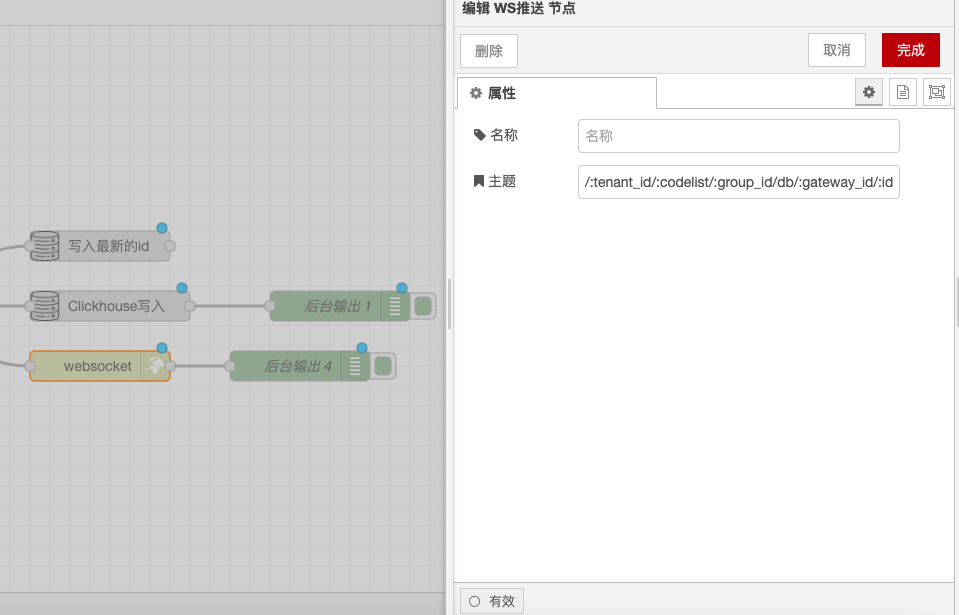

# WebSocket 推送节点

### **功能描述**

WebSocket 输出节点用于通过 WebSocket 发送消息。默认情况下，`msg.payload` 将通过 WebSocket 发送。用户可以将套接字配置为将整个 `msg` 对象编码为 JSON 字符串，然后通过 WebSocket 发送。

### **配置选项**

* **消息内容**：默认情况下，发送 `msg.payload`。可以将节点配置为发送整个 `msg` 对象编码为 JSON 字符串。
* **目标客户端**：如果消息是从 WebSocket In 节点开始的，则该消息将发送回触发流程的客户端。否则，消息将广播给所有连接的客户端。
* **主题（Topic）**：可以通过 `msg.topic` 属性指定消息的主题，以便客户端可以根据主题过滤和处理消息。

### **详细配置**

* **发送整个 `msg` 对象**：
  * 在节点配置中，可以选择将整个 `msg` 对象编码为 JSON 字符串并发送。
  * 这样可以确保所有消息属性都被包含在发送的数据中。
* **广播消息**：
  * 如果需要广播从 WebSocket In 节点开始的消息，应该删除流中的 `msg._session` 属性。
  * 删除 `msg._session` 属性后，消息将广播给所有连接的客户端，而不是仅发送回触发流程的客户端。
* **主题（Topic）**：
  * 可以通过 `msg.topic` 属性指定消息的主题。
  * 客户端可以根据主题过滤和处理消息，实现更灵活的消息路由和处理。

### **示例**

*   **发送 `msg.payload`**：

    ```json
    {
      "payload": "Hello, World!"
    }
    ```
*   **发送整个 `msg` 对象**：

    ```json
    {
      "topic": "example",
      "payload": {
        "message": "Hello, World!"
      }
    }
    ```
*   **指定主题**：

    ```json
    {
      "topic": "news",
      "payload": {
        "headline": "Breaking News",
        "content": "Something important happened."
      }
    }
    ```

### **使用场景**

* **实时通信**：在实时通信应用中，WebSocket 输出节点用于向客户端发送实时数据。
* **状态更新**：在状态更新应用中，WebSocket 输出节点用于向所有连接的客户端广播状态更新。
* **事件通知**：在事件通知系统中，WebSocket 输出节点用于向特定客户端或所有客户端发送事件通知。
* **主题过滤**：在需要根据主题过滤消息的应用中，WebSocket 输出节点用于发送带有主题的消息。

### **注意事项**

* **消息大小**：确保发送的消息大小在 WebSocket 协议的限制范围内。
* **安全性**：在发送敏感信息时，确保进行了适当的加密和身份验证。
* **性能优化**：在处理大量并发连接时，考虑使用适当的 WebSocket 服务器配置和优化。
* **主题一致性**：确保客户端和服务器端对主题的定义和处理一致，避免消息路由错误。

通过这些配置选项和功能，WebSocket 输出节点能够灵活地处理和发送 WebSocket 消息，确保客户端能够实时接收和处理数据。

<figure><figcaption></figcaption></figure>
