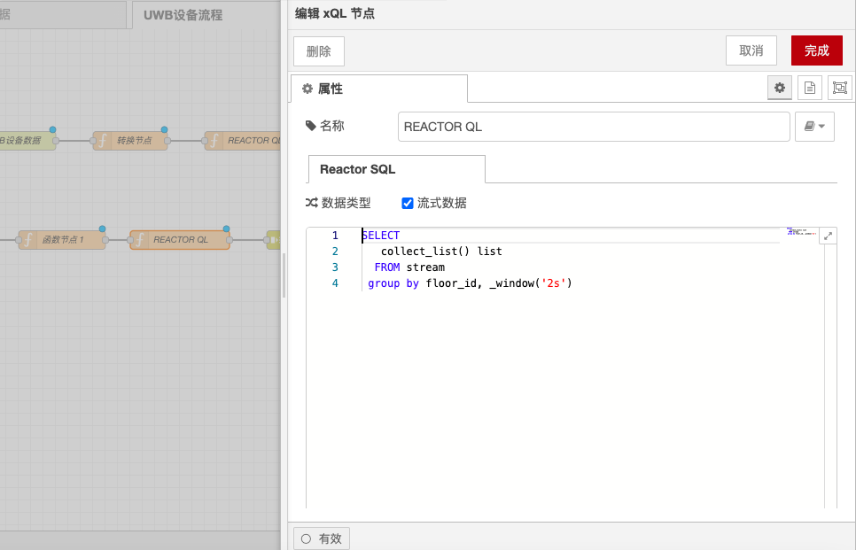

# xQL节点

### **功能描述**

xQL 节点支持使用 SQL 语句过滤或者聚合流数据，并且可以根据 topic 进行模糊过滤。由于数据是持续流入的，执行的聚合函数必须要有对应的分组操作对应，否则 xQL 执行是不会返回结果的。

### **注意事项**

* **分组操作**：由于数据是持续流入的，执行的聚合函数必须要有对应的分组操作对应，否则 xQL 执行是不会返回结果的。
  *   例如，下面的聚合函数不会返回结果，因为没有指定分组条件：

      ```sql
      SELECT * FROM "neuron/1/2/+/properties"
      ```
  *   而下面的 SQL 语句可以顺利执行，因为指定了窗口函数：

      ```sql
      SELECT count(intVal) total, sum(intVal) sum FROM "neuron/1/2/+/properties" GROUP BY _window('500ms');
      ```
  *   下面的 SQL 语句也可以执行，因为数据是持续流入的：

      ```sql
      SELECT * FROM "neuron/1/2/+/properties"
      ```

### **配置步骤**

1. **双击函数节点**：
   * 弹窗内填写节点名称（非必填）以及 SQL 语句。
2. **填写 SQL 语句**：
   * 在弹窗内填写所需的 SQL 语句，确保包含必要的分组操作。
3. **点击完成按钮**：
   * 填写完成后，点击弹窗内的完成按钮，保存配置。

### **示例**

*   **聚合函数示例**：

    ```sql
    SELECT count(intVal) total, sum(intVal) sum FROM "neuron/1/2/+/properties" GROUP BY _window('500ms');
    ```
*   **过滤数据示例**：

    ```sql
    SELECT * FROM "neuron/1/2/+/properties" WHERE intVal > 100;
    ```

### **使用场景**

* **数据聚合**：在需要对流数据进行聚合计算（如计数、求和等）的场景中，使用 xQL 节点进行数据聚合。
* **数据过滤**：在需要根据条件过滤流数据的场景中，使用 xQL 节点进行数据过滤。
* **实时分析**：在实时数据分析应用中，使用 xQL 节点进行实时数据处理和分析。

### **注意事项**

* **分组操作**：确保在聚合函数中包含必要的分组操作，以避免执行无返回结果。
* **SQL 语句**：确保 SQL 语句正确无误，符合 xQL 语法要求。
* **性能优化**：在处理大量数据时，考虑性能优化，如合理设置窗口大小、优化 SQL 查询等。

通过这些配置选项和功能，xQL 节点能够灵活地处理和操作流数据，确保流数据能够按照预定的逻辑进行过滤和聚合。

<figure><figcaption></figcaption></figure>
