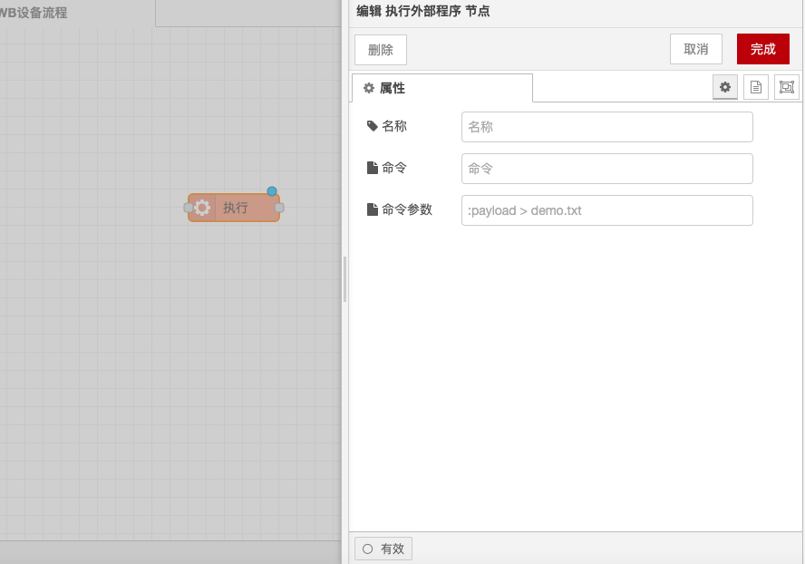

# 执行外部程序节点

### 功能描述

* **运行命令**：节点可以运行系统命令并返回其输出。
* **等待模式**：可以将节点配置为等待命令完成，或者在命令生成时发送其输出。
* **命令来源**：运行的命令可以在节点中配置，也可以由收到的消息提供。

### 输入

* **payload**：字符串，如果这样配置，则将被附加到执行命令中。
* **kill**：字符串，指定发送到现有的exec节点进程的kill信号类型。
* **pid**：数值或字符串，要杀死的现有exec节点进程的进程ID。

### 输出

* **标准输出(stdout)**：
  * **payload**：字符串，命令的标准输出。
  * **rcobject**：（仅执行模式）一个返回代码对象的副本（在端口3上也可用）。
* **标准错误输出(stderr)**：
  * **payload**：字符串，命令的标准错误输出。
  * **rcobject**：（仅执行模式）一个返回代码对象的副本（在端口3上也可用）。
* **返回代码**：
  * **payload**：对象，一个包含返回代码以及message，signal属性的对象。

### 详细

* **默认行为**：默认情况下，使用exec系统调用来调用命令，等待命令完成，然后返回输出。成功的命令的返回码应为 `{code: 0}`。
* **spawn模式**：（可选）可以选择使用spawn代替，它会在命令运行时从stdout和stderr返回输出，通常一次一行。完成后，它将在第三个端口上返回一个对象。成功的命令应返回 `{code: 0}`。
* **错误处理**：错误可能会在第三个端口 `msg.payload` 上返回额外的信息，例如message字符串，signal字符串。
* **命令定义**：运行的命令是在节点内定义的，带有附加 `msg.payload` 的选项和另外一组参数。带空格的命令或参数应该用引号引起来：“这是一个参数”。
* **输出类型**：返回的有效荷载通常是字符串类型，除非检测到非UTF8字符，在这种情况下，它会是buffer类型。
* **状态图标**：节点处于活动状态时，该节点的状态图标和PID将可见。对此更改可以通过Status节点读取。
* **杀死进程**：发送 `msg.kill` 将杀死一个活动进程。`msg.kill` 应该是包含要发送的信号类型的字符串，例如 `SIGINT`，`SIGQUIT` 或 `SIGHUP`。如果设置为空字符串，则默认为 `SIGTERM`。如果节点有多个进程在运行，则还必须设置 `msg.pid` 并设置要杀死的PID的值。
* **超时设置**：如果超时字段提供了一个值，则如果在指定的秒数过去后进程尚未完成，则该进程将自动终止。
* **提示**：如果运行Python应用程序，则可能需要使用 `-u` 参数来停止对输出进行缓存。

通过以上配置，你可以在Node-RED中使用执行外部程序节点运行系统命令，并处理其输出。

<figure><figcaption></figcaption></figure>
