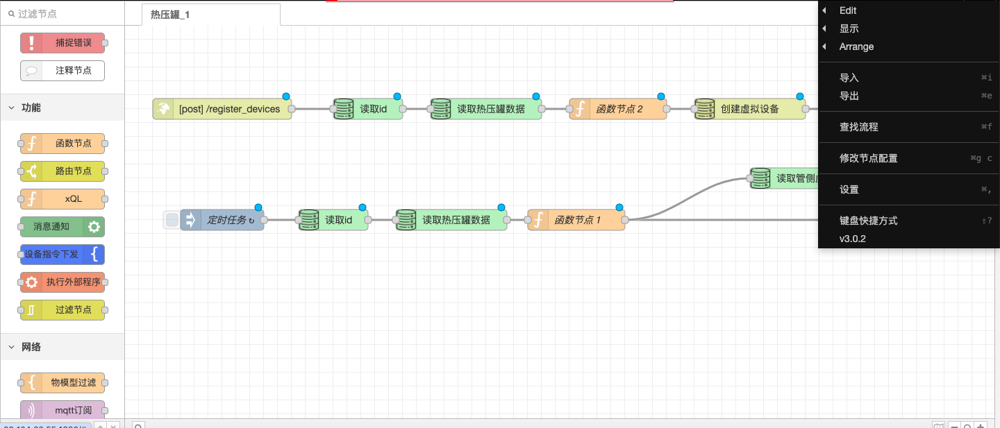

# 2.5.5示例流程

### API 接入流程步骤

1. **添加 HTTP 输入节点**：
   * 从节点面板中拖动一个 HTTP 输入节点到工作区。
   * 双击节点进行配置，设置监听的 URL 路径，例如 `/api`。
2. **添加功能节点**：
   * 拖动一个函数节点到工作区，并将其连接到 HTTP 输入节点。
   * 在函数节点中编写 JavaScript 代码来处理接收到的 HTTP 请求数据。
3. **添加 HTTP 响应节点**：
   * 拖动一个 HTTP 响应节点到工作区，并将其连接到函数节点。
   * 配置 HTTP 响应节点，确保它能够正确返回处理后的数据给客户端。

<figure><figcaption></figcaption></figure>

### 数据库接入流程步骤

1. **安装数据库节点**：
   * 通过 Node-RED 的库管理器安装适用于你数据库类型的节点，例如 `node-red-node-mysql` 或 `node-red-node-postgresql`。
2. **添加数据库节点**：
   * 从节点面板中拖动一个数据库节点（如 MySQL 或 PostgreSQL 节点）到工作区。
   * 双击节点进行配置，输入数据库的连接信息，如主机名、端口、数据库名、用户名和密码。
3. **连接数据库节点**：
   * 将数据库节点连接到你的流程中，例如从 HTTP 输入节点或其他触发节点连接到数据库节点。
   * 配置数据库节点的 SQL 查询或更新语句，以执行所需的数据库操作。

<figure><figcaption></figcaption></figure>

### MQTT 消息接入流程步骤

1. **添加 MQTT 输入节点**：
   * 从节点面板中拖动一个 MQTT 输入节点到工作区。
   * 双击节点进行配置，输入 MQTT 代理的地址和端口，以及你想要订阅的主题，例如 `/mqtt/+/register_devices`。
2. **添加功能节点**：
   * 拖动一个函数节点到工作区，并将其连接到 MQTT 输入节点。
   * 在函数节点中编写 JavaScript 代码来处理接收到的 MQTT 消息，例如从消息中提取 `clientid` 或其他必要信息。
3. **添加其他处理节点**：
   * 根据需要添加其他节点，如分解节点、JDBC 读取节点、合并输入节点等，以进一步处理和操作 MQTT 消息。
4. **添加 MQTT 输出节点**（如果需要发送消息）：
   * 拖动一个 MQTT 输出节点到工作区，并配置其连接和主题信息。
   * 将 MQTT 输出节点连接到适当的节点，以发送处理后的消息到 MQTT 代理。

<figure><figcaption></figcaption></figure>

通过这些步骤，你可以在 Node-RED 中创建一个包含 API 接入、数据库操作和 MQTT 消息处理的完整流程。每个节点都支持通过配置和编写函数来实现特定的功能。
